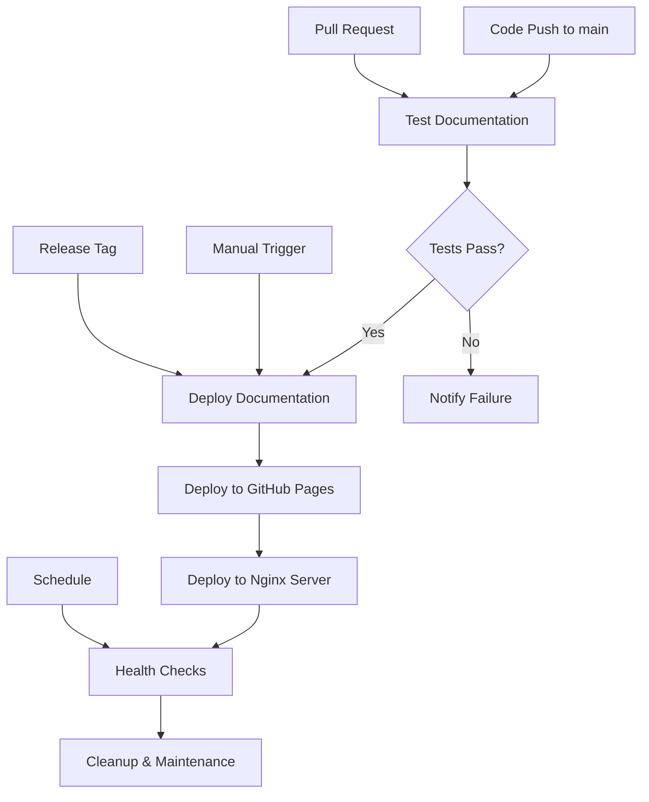

# 🚀 CI/CD Pipeline Documentation

## Overview

This project features a comprehensive CI/CD pipeline that automatically handles documentation updates, version management, testing, and deployment to both GitHub Pages and nginx servers.

## 🔄 Pipeline Architecture



## 📋 Workflow Files

### 1. `deploy-docs.yml` - Main Deployment Pipeline

**Triggers:**
- Push to `main` branch (when docs/, data/, mkdocs.yml, or requirements.txt change)
- Manual workflow dispatch with version input
- Release tags (automatic versioning)

**Features:**
- ✅ **Smart Change Detection**: Only deploys when relevant files change
- ✅ **Automatic Version Generation**: Creates versions based on date and commit
- ✅ **Protected Version Handling**: Prevents overwriting protected versions
- ✅ **Mike Integration**: Full Mike versioning support
- ✅ **GitHub Pages Deployment**: Automatic gh-pages branch updates

**Jobs:**
1. **detect-changes**: Analyzes what files changed and determines deployment strategy
2. **deploy**: Builds and deploys documentation with Mike versioning
3. **notify**: Provides deployment status and summary

### 2. `test-docs.yml` - Testing Pipeline

**Triggers:**
- Pull requests to `main` branch
- Manual testing trigger

**Features:**
- ✅ **Build Testing**: Validates MkDocs build process
- ✅ **Mike Deployment Testing**: Tests versioning without pushing
- ✅ **CSV Data Validation**: Checks lab assignment data integrity
- ✅ **Link Validation**: Scans for broken internal links
- ✅ **Video Path Validation**: Ensures video files exist
- ✅ **Security Scanning**: Checks for secrets and sensitive files

### 3. `deploy-nginx.yml` - Nginx Server Deployment

**Triggers:**
- Successful completion of main deployment pipeline
- Manual trigger with server configuration

**Features:**
- ✅ **SSH Deployment**: Secure server access via SSH keys
- ✅ **Backup Creation**: Automatic backups before updates
- ✅ **Git Synchronization**: Pulls latest from gh-pages branch
- ✅ **Permission Management**: Sets proper file permissions
- ✅ **Nginx Validation**: Tests configuration before reload
- ✅ **Health Checks**: Verifies site accessibility

### 4. `maintenance.yml` - Scheduled Maintenance

**Triggers:**
- Daily schedule (2 AM UTC)
- Manual trigger with check type selection

**Features:**
- ✅ **Health Monitoring**: Checks GitHub Pages and nginx server availability
- ✅ **Link Checking**: Validates external and ATD links
- ✅ **Dependency Scanning**: Reviews Python packages for updates
- ✅ **Cleanup Tasks**: Removes old workflow runs and backups

## 🔧 Setup Requirements

### GitHub Repository Secrets

Add these secrets to your GitHub repository (`Settings` → `Secrets and variables` → `Actions`):

```bash
# Required for nginx deployment
NGINX_SERVER_SSH_KEY  # Private SSH key for server access
```

#### Setting up SSH Key for Nginx Deployment

**Option 1: Use Existing Keypair (Recommended for this project)**

```bash
# 1. Test existing connection
./test_nginx_connection.sh

# 2. Use existing mb-partner-kp.pem for CI/CD
# The setup script will automatically detect and use your existing key

# 3. Add private key to GitHub Secrets
# Copy content of /Users/miguelbalagot/Documents/MyKeyPairs/mb-partner-kp.pem
cat /Users/miguelbalagot/Documents/MyKeyPairs/mb-partner-kp.pem
```

**Option 2: Generate New SSH Key (Alternative)**

```bash
# 1. Generate SSH key pair (on your local machine)
ssh-keygen -t ed25519 -C "github-actions@wwt-docs" -f ~/.ssh/wwt-docs-deploy

# 2. Copy public key to nginx server
ssh-copy-id -i ~/.ssh/wwt-docs-deploy.pub ubuntu@ec2-3-140-61-206.us-east-2.compute.amazonaws.com

# 3. Test SSH connection
ssh -i ~/.ssh/wwt-docs-deploy ubuntu@ec2-3-140-61-206.us-east-2.compute.amazonaws.com

# 4. Add private key to GitHub Secrets
cat ~/.ssh/wwt-docs-deploy
```

### Server Requirements

Your nginx server needs:

#### System Requirements
- **OS**: Ubuntu 20.04+ or similar Linux distribution
- **SSH**: OpenSSH server configured and running
- **Git**: Version 2.25+ installed
- **Nginx**: Version 1.18+ installed and configured
- **User**: `ubuntu` user with sudo privileges

#### Directory Structure
```bash
# Create required directories
sudo mkdir -p /var/www/wwt-acws.duckdns.org
sudo chown -R www-data:www-data /var/www/wwt-acws.duckdns.org
```

#### Nginx Configuration
```nginx
# /etc/nginx/sites-available/wwt-acws.duckdns.org
server {
    listen 80;
    server_name wwt-acws.duckdns.org;

    root /var/www/wwt-acws.duckdns.org;
    index index.html;

    # Handle Mike versioning routes
    location / {
        try_files $uri $uri/ $uri/index.html =404;
    }

    # Security headers
    add_header X-Frame-Options "SAMEORIGIN" always;
    add_header X-Content-Type-Options "nosniff" always;
    add_header X-XSS-Protection "1; mode=block" always;

    # Cache static assets
    location ~* \.(css|js|png|jpg|jpeg|gif|ico|svg)$ {
        expires 1y;
        add_header Cache-Control "public, immutable";
    }
}
```

```bash
# Enable the site
sudo ln -s /etc/nginx/sites-available/wwt-acws.duckdns.org /etc/nginx/sites-enabled/
sudo nginx -t
sudo systemctl reload nginx
```

### Local Development Setup

```bash
# Clone repository
git clone https://github.com/mbalagot12/wwt-docs.git
cd wwt-docs

# Set up UV environment
curl -LsSf https://astral.sh/uv/install.sh | sh
uv venv .venv
source .venv/bin/activate  # Linux/macOS
# or .venv\Scripts\activate  # Windows

# Install dependencies
uv pip install -r requirements.txt

# Test locally with smart port detection
./scripts/version_manager.sh serve
```

## 🎯 Usage Scenarios

### Scenario 1: Regular Documentation Updates

```bash
# 1. Make changes to documentation
vim docs/a_wired/a04_lab.md

# 2. Commit and push
git add .
git commit -m "Update lab documentation"
git push origin main

# 3. Pipeline automatically:
#    - Detects changes
#    - Runs tests
#    - Deploys new version
#    - Updates nginx server
```

### Scenario 2: New Version Release

```bash
# 1. Create and push release tag
git tag v2025.2.STL
git push origin v2025.2.STL

# 2. Create GitHub release
# 3. Pipeline automatically:
#    - Creates version 2025.2.STL
#    - Sets as default version
#    - Deploys to all platforms
```

### Scenario 3: Manual Version Deployment

1. Go to GitHub Actions
2. Select "Deploy Documentation" workflow
3. Click "Run workflow"
4. Enter version details:
   - Version: `2025.2.STL`
   - Description: `Q2 2025 Release`
   - Set as default: `true`
   - **Dry run: `false`** (uncheck for actual deployment)

### Scenario 3a: Dry Run Testing

1. Go to GitHub Actions
2. Select "Deploy Documentation" workflow
3. Click "Run workflow"
4. Enter version details:
   - Version: `2025.2.STL`
   - Description: `Q2 2025 Release`
   - Set as default: `true`
   - **Dry run: `true`** (check for testing only)

### Scenario 4: Testing Pull Requests

```bash
# 1. Create feature branch
git checkout -b feature/new-lab

# 2. Make changes and push
git push origin feature/new-lab

# 3. Create pull request
# 4. Pipeline automatically:
#    - Runs all tests
#    - Validates changes
#    - Reports results
```

## 🧪 Dry Run Capabilities

The CI/CD pipeline includes comprehensive dry-run functionality to test deployments safely before making actual changes.

### Local Dry Run Testing

```bash
# Test version deployment locally
./scripts/version_manager.sh deploy 2025.2.STL "Test version" --dry-run

# Test with push flag (simulated)
./scripts/version_manager.sh deploy 2025.2.STL "Test version" --push --dry-run

# Run comprehensive dry run tests
./test_dry_run.sh
```

### GitHub Actions Dry Run

#### Deploy Documentation (Dry Run)
1. Go to **Actions** → **Deploy Documentation**
2. Click **Run workflow**
3. Fill in details:
   - Version: `2025.2.STL`
   - Description: `Test deployment`
   - Set as default: `false`
   - **Dry run: `true`** ✅
4. Click **Run workflow**

#### Nginx Deployment (Dry Run)
1. Go to **Actions** → **Deploy to Nginx Server**
2. Click **Run workflow**
3. Fill in details:
   - Server host: `ec2-3-140-61-206.us-east-2.compute.amazonaws.com`
   - Force update: `false`
   - **Dry run: `true`** ✅
4. Click **Run workflow**

### What Dry Run Does

#### ✅ **Tests Without Changes**
- Validates MkDocs build
- Tests Mike deployment locally
- Checks SSH connectivity
- Simulates all deployment steps
- Shows exactly what would happen

#### ✅ **Safe Testing**
- No actual deployment to GitHub Pages
- No changes to nginx server
- No git pushes
- No version overwrites
- Complete rollback after testing

#### ✅ **Comprehensive Validation**
- Build process validation
- Configuration checks
- Dependency verification
- Permission testing
- Network connectivity

### Dry Run Workflow

```bash
# 1. Test locally first
./test_dry_run.sh

# 2. Test specific version deployment
./scripts/version_manager.sh deploy 2025.2.STL "Test" --dry-run

# 3. Test GitHub Actions deployment (dry run)
# Use GitHub UI with dry run checkbox

# 4. Test nginx deployment (dry run)
# Use GitHub UI with dry run checkbox

# 5. If all tests pass, deploy for real
./scripts/version_manager.sh deploy 2025.2.STL "Real deployment" --push
```

## 🛡️ Safety Features

### Protected Version System

```yaml
# In deploy-docs.yml
PROTECTED_VERSIONS=("2025.1.STL")
```

- **Prevents accidental overwrites** of important versions
- **Special handling** for protected version updates
- **Force flag required** for protected version changes

### Backup System

- **Automatic backups** before nginx deployments
- **Timestamped backups** for easy recovery
- **Cleanup of old backups** to save space

### Testing Gates

- **All tests must pass** before deployment
- **Build validation** ensures site integrity
- **Link checking** prevents broken references
- **Security scanning** protects against secrets

## 📊 Monitoring & Reporting

### Deployment Summaries

Each workflow provides detailed summaries:
- **Version information**
- **Change detection results**
- **Deployment URLs**
- **Status of all steps**

### Health Monitoring

Daily health checks monitor:
- **GitHub Pages availability**
- **Nginx server status**
- **External link validity**
- **ATD TestDrive links**

### Maintenance Reports

Automated maintenance includes:
- **Dependency updates**
- **Security vulnerability checks**
- **Cleanup of old data**
- **Performance monitoring**

## 🔍 Troubleshooting

### Common Issues

#### Deployment Failures

```bash
# Check workflow logs in GitHub Actions
# Common causes:
# - Authentication issues
# - Protected version conflicts
# - Build errors
# - Server connectivity problems
```

#### Nginx Server Issues

```bash
# SSH to server and check
ssh ubuntu@ec2-3-140-61-206.us-east-2.compute.amazonaws.com
sudo systemctl status nginx
sudo nginx -t
```

#### Version Conflicts

```bash
# Check current versions
./scripts/version_manager.sh list

# Force update if needed (use carefully)
mike deploy 2025.1.STL "Force update" --force --push
```

### Emergency Procedures

#### Rollback Deployment

```bash
# 1. SSH to nginx server
ssh ubuntu@ec2-3-140-61-206.us-east-2.compute.amazonaws.com

# 2. Restore from backup
sudo rm -rf /var/www/wwt-acws.duckdns.org
sudo mv /var/www/wwt-acws.duckdns.org.backup.TIMESTAMP /var/www/wwt-acws.duckdns.org

# 3. Reload nginx
sudo systemctl reload nginx
```

#### Disable Automatic Deployment

```yaml
# In .github/workflows/deploy-docs.yml
# Comment out or modify triggers:
on:
  # push:
  #   branches: [ main ]
  workflow_dispatch:  # Keep manual trigger only
```

## 📈 Performance Optimization

### Workflow Efficiency

- **Parallel job execution** where possible
- **Conditional job execution** based on changes
- **Caching of dependencies** (UV environment)
- **Minimal checkout depth** for faster clones

### Server Optimization

- **Incremental updates** via git pull
- **Nginx configuration validation** before reload
- **Proper file permissions** for security
- **Backup rotation** to manage disk space

## 🔮 Future Enhancements

### Planned Features

- **Multi-environment support** (staging, production)
- **Blue-green deployments** for zero downtime
- **Advanced monitoring** with metrics collection
- **Slack/Teams notifications** for deployment status
- **Automated dependency updates** with Dependabot
- **Performance testing** integration

### Integration Opportunities

- **Content delivery network** (CDN) integration
- **Search engine optimization** (SEO) checks
- **Accessibility testing** automation
- **Load testing** for high traffic scenarios

## 📚 References

- [GitHub Actions Documentation](https://docs.github.com/en/actions)
- [Mike Versioning Guide](https://github.com/jimporter/mike)
- [MkDocs Material](https://squidfunk.github.io/mkdocs-material/)
- [Nginx Configuration](https://nginx.org/en/docs/)

---

**🎉 Your CI/CD pipeline is now fully automated and production-ready!**
