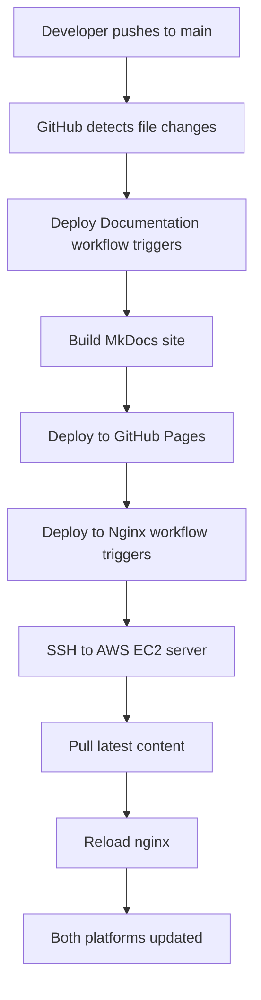
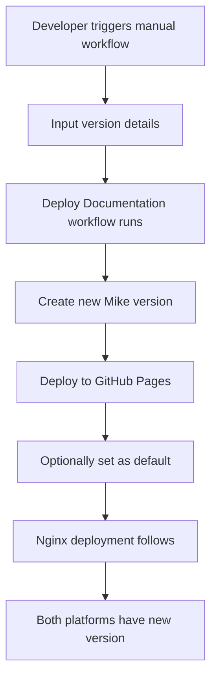

# 🚀 GitHub Actions Automated Deployment Guide

## Overview

GitHub Actions automates your documentation deployment through intelligent workflows that detect changes, build documentation, and deploy to multiple platforms (GitHub Pages + AWS EC2 nginx server).

## 🔄 **Automation Workflows**

### **1. Deploy Documentation Workflow** (`deploy-docs.yml`)

**Purpose**: Main deployment workflow for documentation versioning and GitHub Pages

#### **Automatic Triggers:**
```yaml
on:
  push:
    branches: [ main ]
    paths:
      - 'docs/**'        # Documentation content
      - 'data/**'        # Data files
      - 'mkdocs.yml'     # Configuration
      - 'requirements.txt' # Dependencies
```

**What this means:**
- ✅ **Automatic deployment** when you push changes to documentation files
- ✅ **Smart detection** - only triggers when relevant files change
- ✅ **No manual intervention** required for routine updates

#### **Manual Triggers:**
```yaml
workflow_dispatch:
  inputs:
    version: '2025.2.STL'
    description: 'Q2 2025 Release'
    set_default: true/false
    dry_run: true/false
```

**How to use:**
1. Go to **Actions** tab in GitHub
2. Select **"Deploy Documentation"**
3. Click **"Run workflow"**
4. Fill in parameters
5. Click **"Run workflow"**

### **2. Deploy to Nginx Server Workflow** (`deploy-nginx.yml`)

**Purpose**: Automatically syncs GitHub Pages content to your AWS EC2 nginx server

#### **Automatic Triggers:**
```yaml
workflow_run:
  workflows: ["Deploy Documentation"]
  types: [completed]
```

**What this means:**
- ✅ **Automatically runs** after documentation deployment succeeds
- ✅ **Syncs content** to your nginx server at `ec2-3-140-61-206.us-east-2.compute.amazonaws.com`
- ✅ **No manual steps** needed for dual-platform deployment

## 🎯 **Complete Automation Flow**

### **Scenario 1: Content Change Automation**



### **Scenario 2: Manual Version Release**



## 🛠️ **Workflow Components**

### **Change Detection Job**
```yaml
detect-changes:
  outputs:
    docs_changed: ${{ steps.changes.outputs.docs }}
    should_deploy: ${{ steps.decision.outputs.should_deploy }}
```

**Purpose:**
- ✅ **Intelligent detection** of what changed
- ✅ **Skip unnecessary builds** when only non-docs files change
- ✅ **Optimize CI/CD performance**

### **Build and Deploy Job**
```yaml
build-and-deploy:
  needs: detect-changes
  if: ${{ needs.detect-changes.outputs.should_deploy == 'true' }}
```

**Steps:**
1. **Checkout code** with full history
2. **Set up Python** and dependencies
3. **Install MkDocs** and Mike
4. **Build documentation**
5. **Deploy with Mike versioning**
6. **Push to gh-pages branch**

### **Nginx Deployment Job**
```yaml
deploy-to-nginx:
  if: ${{ github.event.workflow_run.conclusion == 'success' }}
```

**Steps:**
1. **Wait for docs deployment** to complete
2. **SSH to AWS EC2 server**
3. **Pull latest content** from gh-pages branch
4. **Update file permissions**
5. **Reload nginx service**

## 🔒 **Security and Authentication**

### **Secrets Used:**
- `WWT_DOCS_TOKEN`: Your GitHub Personal Access Token
- `NGINX_SERVER_SSH_KEY`: SSH private key for AWS EC2 access

### **Secure Practices:**
- ✅ **Encrypted secrets** storage
- ✅ **Limited scope** tokens
- ✅ **SSH key authentication**
- ✅ **No hardcoded credentials**

## 🧪 **Dry-Run Capabilities**

### **Safe Testing:**
```yaml
dry_run:
  description: 'Dry run (test without deploying)'
  type: boolean
  default: false
```

**When enabled:**
- ✅ **Tests all steps** without actual deployment
- ✅ **Validates configuration** and permissions
- ✅ **Shows what would happen** without risk
- ✅ **Perfect for testing** new versions

## 📊 **Monitoring and Notifications**

### **Workflow Status:**
- ✅ **Real-time progress** in Actions tab
- ✅ **Email notifications** on failure
- ✅ **Detailed logs** for troubleshooting
- ✅ **Success/failure badges** in README

### **Health Checks:**
```yaml
# maintenance.yml
schedule:
  - cron: '0 6 * * *'  # Daily at 6 AM UTC
```

**Automated monitoring:**
- ✅ **Daily health checks** of both platforms
- ✅ **Link validation** for external references
- ✅ **Performance monitoring**
- ✅ **Automatic issue creation** on failures

## 🎮 **How to Use GitHub Actions**

### **For Routine Content Updates:**

1. **Edit your documentation** files in `docs/`
2. **Commit and push** to main branch
3. **GitHub Actions automatically:**
   - Detects changes
   - Builds documentation
   - Deploys to GitHub Pages
   - Syncs to nginx server
4. **Both platforms updated** within minutes

### **For Version Releases:**

1. **Go to Actions tab** in GitHub
2. **Select "Deploy Documentation"**
3. **Click "Run workflow"**
4. **Fill in details:**
   - Version: `2025.2.STL`
   - Description: `Q2 2025 Release`
   - Set as default: `true`
   - Dry run: `false` (or `true` for testing)
5. **Click "Run workflow"**
6. **Monitor progress** in real-time

### **For Emergency Updates:**

1. **Use manual nginx deployment:**
   - Go to Actions → "Deploy to Nginx Server"
   - Click "Run workflow"
   - Set server: `ec2-3-140-61-206.us-east-2.compute.amazonaws.com`
   - Force update: `true`
2. **Immediate deployment** to nginx server

## 🔧 **Customization Options**

### **Trigger Customization:**
```yaml
# Add more file paths to watch
paths:
  - 'docs/**'
  - 'custom/**'
  - 'assets/**'
```

### **Environment Customization:**
```yaml
env:
  PYTHON_VERSION: '3.11'
  CUSTOM_BUILD_ARGS: '--strict'
```

### **Notification Customization:**
```yaml
# Add Slack, Discord, or email notifications
- name: Notify on success
  uses: 8398a7/action-slack@v3
```

## 📈 **Benefits of GitHub Actions Automation**

### **Efficiency:**
- ⚡ **Instant deployment** on content changes
- ⚡ **No manual steps** for routine updates
- ⚡ **Parallel deployment** to multiple platforms
- ⚡ **Automated testing** before deployment

### **Reliability:**
- 🛡️ **Consistent deployment** process
- 🛡️ **Error handling** and rollback capabilities
- 🛡️ **Dry-run testing** before production
- 🛡️ **Automated health monitoring**

### **Scalability:**
- 📈 **Handle multiple versions** simultaneously
- 📈 **Support team collaboration**
- 📈 **Integrate with external tools**
- 📈 **Extend to additional platforms**

## 🚀 **Getting Started**

### **Your workflows are already configured and ready!**

1. **Test with dry-run:**
   - Actions → Deploy Documentation → Run workflow
   - Check "Dry run" checkbox
   - Monitor the test execution

2. **Make a content change:**
   - Edit any file in `docs/`
   - Commit and push to main
   - Watch automatic deployment

3. **Create a new version:**
   - Use manual workflow trigger
   - Specify version number
   - Set as default if needed

**Your GitHub Actions automation is ready to streamline your documentation deployment process!** 🎉
