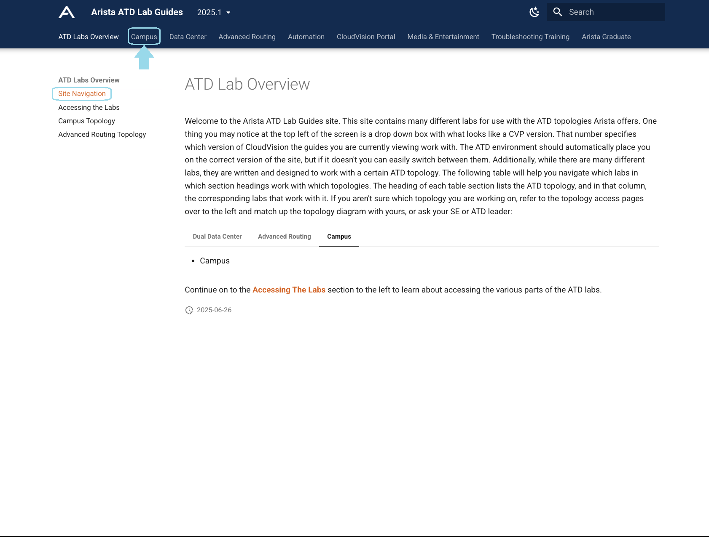

# A-02-ATD | Provisioning a Campus Fabric - Virtual Lab

## Overview

In this lab you will be using Arista Test Drive (ATD) to simulate a campus leaf switch using CloudVision Studios, adding your new campus leaf switch to an existing Campus Fabric using Arista's Test Drive (ATD) virtual lab environment.

ATD provides a fully virtualized network topology that mirrors real-world campus deployments, allowing you to experience Arista's campus solutions without physical hardware. Your virtual environment includes:

- **Pre-configured Campus Infrastructure**: Virtual spine switches acting as your campus core
- **Virtual Leaf Switches**: Simulated campus access switches already onboarded with CloudVision
- **CloudVision Integration**: Full access to CloudVision Studios for fabric management
- **Realistic Network Scenarios**: Experience the same workflows you'd use in production

Your environment has been pre-configured with a sample Campus to assist with these new concepts. Studios is equipped with flexible constructs that give you the ability to describe your campus footprint. These will be common throughout this workshop:

## ATD Lab Access

To begin this lab, you'll need to access your assigned ATD (Arista Test Drive) virtual lab environment.

1. Navigate to your assigned ATD lab URL provided by your instructor
2. Login using the credentials provided for your lab instance
3. Once logged in, you should see the ATD welcome screen similar to the example below. Click on the "Click Here to Access Topology" button to enter the lab environment.

    <figure markdown>
    { loading=lazy }
    </figure>

4. To access the lab guides within your virtual environment, look for the vertical navigation bar on the left side of the screen and click on "Lab Guides" as shown below. You'll also find your lab credentials provided at the bottom of the page.

    <figure markdown>
    { loading=lazy }
    </figure>

5. Once in the Lab Guides section, choose the "Campus" lab from the horizontal navigation bar to access the campus-specific lab instructions.

    <figure markdown>
    { loading=lazy }
    </figure>

6. Choose the "CV Studios - Layer 2 Leaf Spine" lab and click on the "Access This Lab" button to begin the campus fabric provisioning exercise.

    <figure markdown>
    { loading=lazy }
    </figure>

7. Choose the "CloudVision Studios - L2LS" labs to access the specific lab instructions for this exercise. Follow the lab instructions to complete all the steps required to create a campus fabric.

    <figure markdown>
    { loading=lazy }
    </figure>

The ATD environment provides you with a complete virtual campus network topology where you can practice the same provisioning workflows used in production environments.

!!! tip "🎉 CONGRATS! You have completed this lab! 🎉"

    [:material-login: LET'S GO TO THE NEXT LAB!](./a03_lab.md){ .md-button .md-button--primary }
