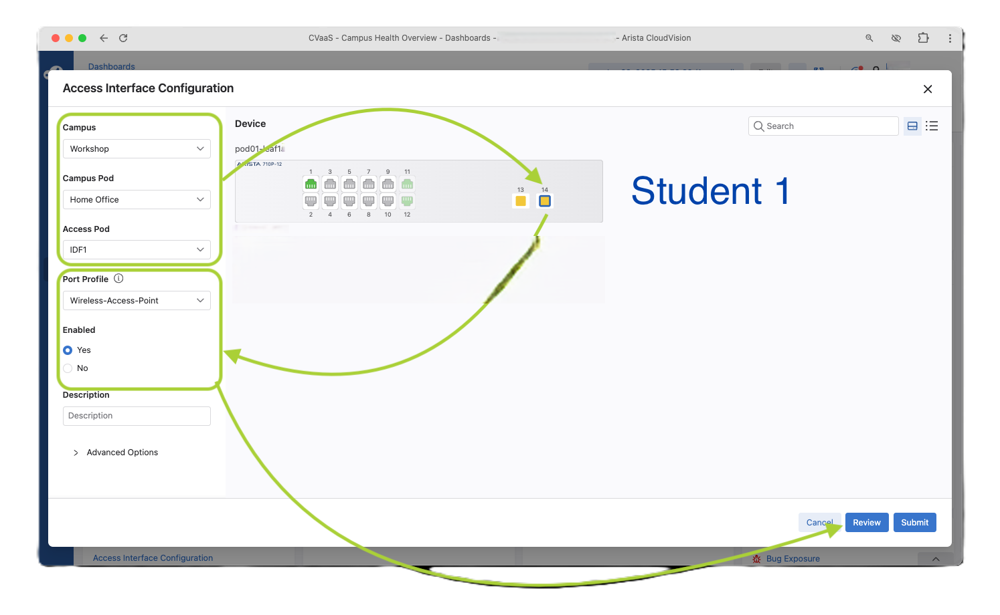
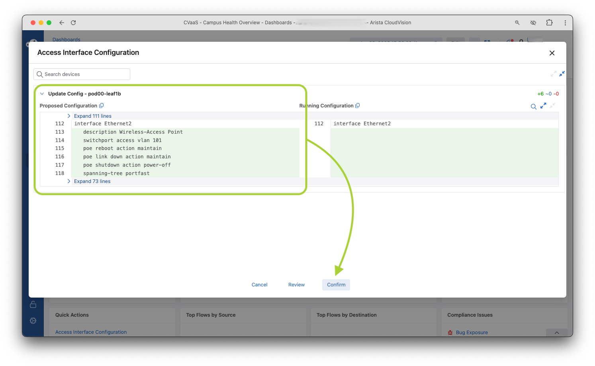
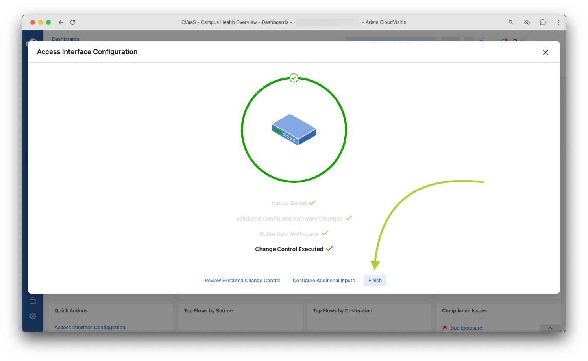
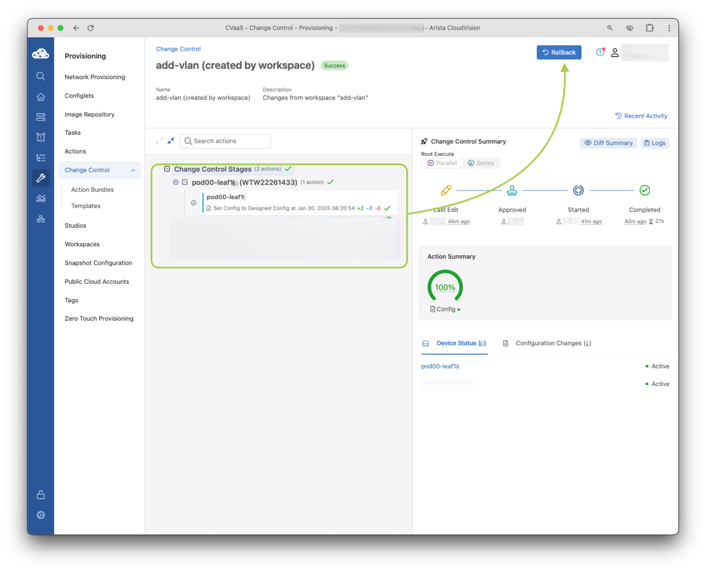

# A-03 | Switch Onboarding with Inventory Studio & Access Interface Configuration

## Overview

This lab combines two essential CloudVision workflows: onboarding switches using Inventory Studio and configuring access interfaces. You'll learn to use CloudVision's visual interface to add new devices and then configure port profiles for connected hosts.

--8<--
docs/snippets/topology.md
docs/snippets/login_cv.md
docs/snippets/workspace.md
--8<--

## Part 1: Switch Onboarding with Inventory Studio

### Video Walkthrough

Before we begin the hands-on portion, watch this demonstration video that shows the complete switch onboarding process using Inventory Studio:

  <video 
    id="demo-video"
    width="100%" 
    controls 
    controlslist="nodownload"
    preload="metadata"
    aria-label="CloudVision Inventory Studio Walkthrough"
    onloadeddata="videoLoaded()"
    onerror="videoError()"
  >
    <!-- MkDocs standard paths for docs/demos/ folder -->
    <source src="demos/01_inventory_studio.mp4" type="video/mp4">
    <source src="./demos/01_inventory_studio.mp4" type="video/mp4">
    <source src="../demos/01_inventory_studio.mp4" type="video/mp4">
    <!-- Absolute path from site root -->
    <source src="/demos/01_inventory_studio.mp4" type="video/mp4">
    
    <!-- Fallback content -->
    

      
<strong>⚠️ Video cannot be loaded</strong>

      
This might be due to:

      <ul style="text-align: left; display: inline-block;">
        <li>Missing video file in the demos folder</li>
        <li>Incorrect file path</li>
        <li>Browser compatibility issues</li>
      </ul>
      

        <button onclick="retryVideo()" class="retry-btn">🔄 Retry Loading</button>
      

    

  </video>
  
  <!-- Loading indicator -->
  

    
📺 Loading video...

  

  
<!-- Video info -->
  

    <small>
      💡 <strong>Tip:</strong> Use spacebar to play/pause, arrow keys to skip forward/back
    </small>
  

### Onboarding Your Switch

Now that you've seen the process, let's onboard your assigned switch using the same workflow demonstrated in the video.

!!! danger "Single Workspace"

    Make sure you complete this in a **single workspace**.

#### Step 1: Access Inventory Studio

1. Navigate to `Studios` from the main CloudVision menu
2. Locate and click on `Inventory Studio`
3. Create a new workspace or use an existing one

#### Step 2: Identify Your Device

1. In the Inventory Studio interface, look for devices in the "Network Updates" section
2. Identify your assigned switch using the serial number from your lab assignment
3. Your device should appear with a hostname like `sw-X.X.X.X` indicating it's in ZTP mode
4. Select your device by checking the box next to it. Click on `Accept Updates`, then click `Accept` in the confirmation dialog
5. Complete the `Workspace` as shown in the video walkthrough

#### Video Walkthrough - Applying base configuration

  <video 
    id="base-config-video"
    width="100%" 
    controls 
    controlslist="nodownload"
    preload="metadata"
    aria-label="CloudVision Base Configuration Walkthrough"
    onloadeddata="videoLoaded()"
    onerror="videoError()"
  >
    <!-- MkDocs standard paths for docs/demos/ folder -->
    <source src="demos/02_base_config.mp4" type="video/mp4">
    <source src="./demos/02_base_config.mp4" type="video/mp4">
    <source src="../demos/02_base_config.mp4" type="video/mp4">
    <!-- Absolute path from site root -->
    <source src="/demos/02_base_config.mp4" type="video/mp4">
    
    <!-- Fallback content -->
    

      
<strong>⚠️ Video cannot be loaded</strong>

      
This might be due to:

      <ul style="text-align: left; display: inline-block;">
        <li>Missing video file in the demos folder</li>
        <li>Incorrect file path</li>
        <li>Browser compatibility issues</li>
      </ul>
      

        <button onclick="retryVideo()" class="retry-btn">🔄 Retry Loading</button>
      

    

  </video>
  
  <!-- Loading indicator -->
  

    
📺 Loading video...

  

  
  <!-- Video info -->
  

    <small>
      💡 <strong>Tip:</strong> Use spacebar to play/pause, arrow keys to skip forward/back
    </small>
  

Following the video demonstration:

#### Step 3: Apply Base Network Configuration

1. In `Static Configuration` studio, Click on `Configlet Library`
   - **Search for your base config**: `base-pod##` (where ## is your pod number)
   - **Optionally review it**
2. Create `SubContainer` for your device and tag `base_config` and value `pod##`
   - **Note**: Studios will prompt you to build the Workspace several times. Click on `Build Workspace`
3. Apply the base configuration to your device as shown in the video
   - Click `Review Workspace`
   - Click `Submit Workspace`
   - Click `View Change Control`
   - Click `Review and Approve`
   - Toggle `Execute Immediately` and click `Approve and Execute`

### Verification

After the onboarding process completes:

1. Navigate to `Devices` > `Inventory` to verify your switch appears with the correct hostname
2. Check that the device status shows as `Active` and `Streaming`
3. Verify the device appears in the correct location within your campus hierarchy

### Troubleshooting

#### Switch Onboarding Issues

If you encounter issues during onboarding:

- Ensure your device is properly connected to the network
- Verify the device is receiving DHCP and can reach CloudVision

---

## Part 2: Access Interface Configuration

Now that your switches are onboarded, let's configure port profiles and apply them to interfaces in your network. But first, let's build the campus fabric.

### Video Walkthrough - Build the Campus Fabric

  <video 
    id="access-config-video"
    width="100%" 
    controls 
    controlslist="nodownload"
    preload="metadata"
    aria-label="CloudVision Campus Fabric Configuration Walkthrough"
    onloadeddata="videoLoaded()"
    onerror="videoError()"
  >
    <!-- MkDocs standard paths for docs/demos/ folder -->
    <source src="demos/03_campus_fabric.mp4" type="video/mp4">
    <source src="./demos/03_campus_fabric.mp4" type="video/mp4">
    <source src="../demos/03_campus_fabric.mp4" type="video/mp4">
    <!-- Absolute path from site root -->
    <source src="/demos/03_campus_fabric.mp4" type="video/mp4">
    
    <!-- Fallback content -->
    

      
<strong>⚠️ Video cannot be loaded</strong>

      
This might be due to:

      <ul style="text-align: left; display: inline-block;">
        <li>Missing video file in the demos folder</li>
        <li>Incorrect file path</li>
        <li>Browser compatibility issues</li>
      </ul>
      

        <button onclick="retryVideo()" class="retry-btn">🔄 Retry Loading</button>
      

    

  </video>
  
  <!-- Loading indicator -->
  

    
📺 Loading video...

  

  
  <!-- Video info -->
  

    <small>
      💡 <strong>Tip:</strong> Use spacebar to play/pause, arrow keys to skip forward/back
    </small>
  

### Creating Port Profiles

1. From the `Studios` home page, disable the `Active Studios` toggle to display all available CloudVision Studios (which when enabled will only show used/active Studios).

    !!! note "The toggle may already be in the disabled position"

      

2. Let's create two port profiles using the `Access Interface Configuration` studio that will be used to provision connected hosts.

    1. Launch the `Access Interface Configuration`
    2. Click `+ Add Port Profile`, name it `WAP`, and click the arrow on the right

    3. Enter the following values on this configuration page, you can leave all other configuration items left as default. See the settings are configured in the screenshot below
    
        **VLAN pod numbers between 01-20 that was assigned to your lab/Pod. Example: `Pod01` is `VLAN101`, `Pod13` is `VLAN113`*

        ???+ example "WAP"

            | Key                  | Value                                        |
            | -------------------- | -------------------------------------------- |
            | Description          | `WAP`                                        |
            | Enable               | Yes                                          |
            | Mode                 | Access                                       |
            | VLANS                | `1##` where `##` is your 2 digit pod number* |
            | Portfast             | Edge                                         |
            | POE Reboot Action    | Maintain                                     |
            | POE Link Down Action | Maintain                                     |
            | POE Shutdown Action  | Power-Off                                    |

        **VLAN pod numbers between 01-20 that was assigned to your lab/Pod. Example: `Pod01` is `VLAN101`, `Pod13` is `VLAN113`*

       

    4. Once you are done with configuration, navigate back to `Access interface Configuration` near the top of the page, under the `Quick Actions`

       

3. Let's add another port profile for our Raspberry Pi, click `Add Port Profile`, name it `Wired-RasPi`, and click the arrow on the right

    ???+ example "Wired-RasPi"

        | Key                      | Value                                        |
        | ------------------------ | -------------------------------------------- |
        | Description              | `Wired-RasPi`                                |
        | Enable                   | Yes                                          |
        | Mode                     | Access                                       |
        | VLANS                    | `1##` where `##` is your 2 digit pod number* |
        | Portfast                 | Edge                                         |
        | 802.1X                   | Enabled                                      |
        | MAC Based Authentication | Yes                                          |
        | POE Reboot Action        | Maintain                                     |
        | POE Link Down Action     | Maintain                                     |
        | POE Shutdown Action      | Power-Off                                    |

        **VLAN pod numbers between 01-20 that was assigned to your lab/Pod. Example: `Pod01` is `VLAN101`, `Pod13` is `VLAN113`*

4. Our port profiles have been staged, click `Review Workspace`

5. We can see the only studio changed is the `Access Interface Configuration`, no configuration on the devices has changed.

    

6. Go ahead and `Submit the Workspace` when you ready

    !!! warning "Note that device configuration has NOT changed after submitting this workspace. If you see something different, create a new workspace and try again or reach out to the event staff."

### Assigning Port Profiles

!!! danger "No Workspace"

    Now that you have port profiles, you can each individually configure ports on your assigned switch! No workspace required here 😄

1. We are going to assign our new port profiles to our switch, specifically assign ports for

      1. `Ethernet1`: our access port for the Raspberry Pi
      2. `Ethernet7`: our access port for the Access Point
      3. `Ethernet9`: our access port for the Access Point

2. Let's configure our Access Point port, make sure you identify your assigned switch `pod<##>-leaf1`

    !!! warning "Your Device"

        **NOTE**: You will see a slightly different front panel layout, this is the difference between the 710P-12P and the 710P-16P you have in front of you.

    === "Student 1"

         1. Click on port `Ethernet7` on your assigned switch
         2. Choose the `Port Profile` of `WAP`
         3. Click `Yes` radio button under `Enabled`
         4. Repeat steps 1-3 for port `Ethernet9`
         5. Click `Review`

         

3. You can review the configuration before pushing, but all in the same workflow. Hit `Confirm` to push the access port config when ready!

    

4. Once the `Change Control` has been executed, click `Configure Additional Inputs` to configure another access port

    

5. Let's now configure our Raspberry Pi port, make sure you identify your assigned switch `pod<##>-leaf1`

    !!! warning "Your Device"

        Make sure to select your device, see the tabs below!

        **NOTE**: You will see a slightly different front panel layout, this is the difference between the 710P-12P and the 710P-16P you have in front of you.

    === "Student 1"

         

6. This time Click `Submit`

7. This has pushed the configuration without review! This streamlined the process for low risk changes like access port changes. Once `Change Control` has been executed, click `Finish`

    

8. Quick actions is using the same CloudVision Change Control workflow, the exception here is it's auto approved to allow low risk/impact changes easier. You can view this change control in the `Change Control` tab and see the generated task.

    

## Adding a VLAN

Adding a VLAN is a common provisioning task. Let’s use the existing Campus Fabric Studio to add an incremental configuration (add a VLAN). This VLAN will be specific to your pod and not routable outside.

!!! danger "Single Workspace"

    You and your fellow student will work together to create a new VLAN in your campus fabric using a **single workspace**.

1. Once the workspace is created, open the existing `Campus Fabric (L2/L3/EVPN)` studio.

    

    1. Validate that the `Device Selection` still applies to `All Devices`

    2. `Within the Campus Services (Non-VXLAN)` navigate to `Campus: Workshop > Campus-Pod: Home Office` using the arrow :material-greater-than: on the right

    === "Workshop"

        

    === "Home Office"

        

2. We are going to add a new VLAN and add to the `Home Office` Campus POD.

    1. Click the `+ Add VLAN` button

    2. Add the `VLAN 2##`, where `##` is your pod number and click the right arrow :material-greater-than:

        

    3. Customize the new VLAN by giving it a `Name`
    4. Add the VLAN to the Access-Pod by clicking `+ Add Pod` and selecting `IDF1`

        

    5. Let's click `Review Workspace` to submit the staged changes.

3. Review and Submit Workspace

    1. Notice that the Studio is adding the VLAN to the two devices within the Pod.

        !!! tip "Pruning VLANS"

            Outside of this lab topology, when you add vlans to a Layer 2 leaf like this, Studios will generate the necessary configuration to trunk the new VLAN to the spines or upstream MLAG pair when using LSS.

        ??? warning "No changes?!"

            If you are not seeing any proposed changes, make sure you selected an `Access-Pod` within the VLAN configuration. (See step 2e)

    2. Once you review the changes, click `Submit Workspace`

        

    3. Click View `Change Control`

        

    4. Review the Change Control and select `Review and Approve`

        

    5. Toggle the `Execute Immediately` button and select `Approve and Execute`

        

4. Verify the VLAN has been added to the device configuration by using the Device `Comparison` function.

    1. Click `Devices`, the click on `Comparison`, and select a `Time Comparison`

        

    2. Choose a device from the list, such as `leaf1a`

    3. Select a time period, for example `30 minutes ago` and click the `Compare` button

        

    4. The first screen presented shows the overview, navigate to the `Configuration` tab on the left

        

    5. Select the Configuration section

        !!! tip "Timeseries in CloudVision"

            We expect the configuration changed within the last 30 minutes, but all streaming data from the switch (including configuration) is stored in a timeseries database. So anything from routing table, MAC, ARP, and more is accessible for historical review and comparisons like this!

        

5. Lab section completed! In the next lab section you will see how to roll back a previous change control

## Rollback a Change Control

There is no question at some point in  your career, there has been a situation you've been asked to roll back a configuration change and restore back to previous state. You may need to do this for all devices affected by a change, or only a subset of devices under troubleshooting.

CloudVision Change Controls are built with this flexibility in mind, granular change management per device or fleet-wide. Specifically targeting actions or tasks that have taken place can be identified and rolled back when needed.

1. Let’s roll back the change control we used to add a VLAN via Studios.

2. First go to `Provisioning` then `Change Control`. Select the change control corresponding to your VLAN addition

    

3. Click the `Rollback` button

    

4. In the next screen, select the top list check mark to select all the devices and click `Create Rollback Change Control`

    

5. Verify the Configuration Changes section by clicking `Diff Summary`  Once you have reviewed the change, click the `Review and Approve` button

    

6. Again, you'll be presented with one more opportunity to review the changes. Select `Execute Immediately` if not already toggled on and `Approve and Execute`

    

7. Monitor the change control for completion to ensure the added VLAN is cleaned up on all switches.

    === "Start"

        

    === "Finish"

        

8. You have now successfully added a VLAN through Studios and then rolled back that change across all switches.

!!! tip "🎉 CONGRATS! You have completed this lab! 🎉"

    Your switch is now successfully onboarded and ready for further configuration. You've also learned how to create and assign port profiles for access interfaces.

    [:material-login: LET'S GO TO THE NEXT LAB!](./a04_lab.md){ .md-button .md-button--primary }

--8<-- "includes/abbreviations.md"

<!-- Custom CSS and JavaScript for enhanced video experience -->

