# B-01 | Arista Wireless Setup

## Overview

In this lab we are going to explore the Arista Launchpad in more depth, explain how Access Points are onboarded, configured, and troubleshot in a live environment.

--8<--
docs/snippets/topology.md
docs/snippets/login_cvcue.md
--8<--

## Arista Launchpad

Launchpad is the portal to access your Arista cloud services including **WiFi Management (CV-CUE)** and **AGNI (Network Access Control)**. When you open the launcher, you are presented with management applications on the`Dashboard` menu and access controls with the`Admin` menu.

When you open the launcher, you are presented with multiple applications. Each is included with the subscription (as is support).

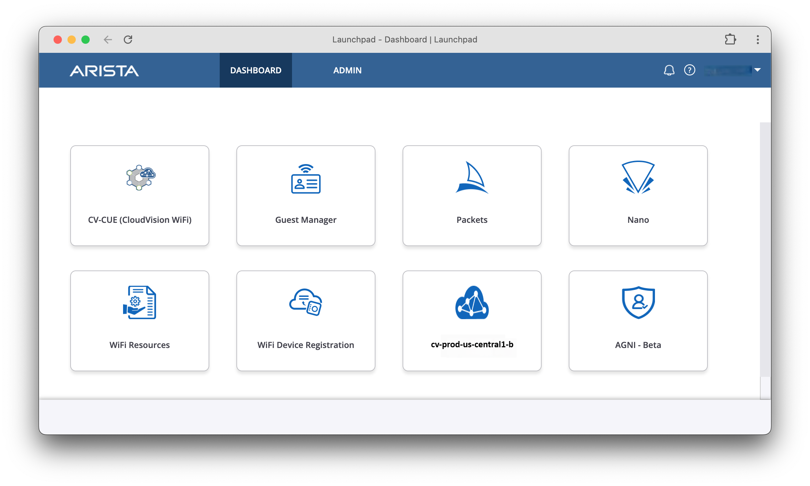

- :cvp: **CV-CUE CloudVision-WiFi**: Wireless Manager.
- :fontawesome-solid-user-gear: **Guest Manager**: looks at the users and how they are interacting with your environment.
- :material-cellphone-cog: **Nano**: manage your environment from your smartphone
- :material-shark-fin: **Packets**: an online .pcap debug allowing you to examine the packet information.
- :simple-googledocs: **WiFi Resources**" includes documentation and over 6 ½ hours of online training, also included.
- :material-access-point-plus: **WiFi Device Registration:** application for importing APs into your account
- :agni: **AGNI**: network access control
- :cvp: **CVP Staging (CloudVision Portal)**: switch Management and staging Environment

### Add a User and Assign Privileges

1. First, use the Admin menu to add a user.
2. Click on the Admin Tab at the top of the Launchpad window:

    

3. Overview of Launchpad Admin menu:
      1. **Users** - Assign Access to users with different access levels as well as to specific folders
      2. **Keys** - Used with API integrations
      3. **Profiles** - Defines Access levels to CV-CUE, LaunchPad, and Guest Manager
      4. **Logs** - Download User Action Logs
      5. **Settings** - Lockout Policy, Password Policy, and 2-Factor settings

!!! tip "Authentication"

    CloudVision CUE authenticates users via SAML directory integration or via the Launchpad identity providers. These can be customized with local users in Launchpad or directory single-sign-on users.
    More information on Arista Communities, [Integrating Third-Party SAML Authentication Providers](https://arista.my.site.com/AristaCommunity/s/article/Integrating-Third-Party-SAML-Solution-Providers-with-Arista-CV-CUE){target="_blank"}

### AP Registration

!!! danger "Reference Information"

    For this lab, these steps have already been done for you by event staff.

    Arista AP serial numbers are automatically assigned to the user’s CV-CUE staging area when purchased. In addition, specific devices can be registered for management using the `WiFi Device Registration` function, accessible from `Launchpad Dashboard`.

1. Let’s click on the `Dashboard` menu option on the left hand side of the screen. This opens the `Dashboard Overview` screen which provides us with numerous metrics for our wireless environment.

    

2. Within the `Import` function you can provide individual AP serials and keys or upload a CSV.

    

3. Assign Access points to Wireless Manager Service

    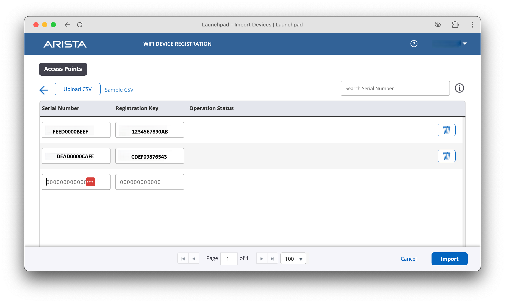

## CV-CUE CloudVision WiFi Access

CloudVision CUE - Cognitive Unified Edge, provides the management plane and monitoring functions for the Arista WiFi solution.

1. Click on the `CV-CUE (CloudVision WiFi)` Tile in the LaunchPad from the Dashboard menu.

    

2. When the CV-CUE interface launches, you are presented with an initial dashboard to monitor your wireless environment at a glance, we will revisit these metrics later in the lab. Since this is a new setup the initial dashboard screen will be mostly empty.

    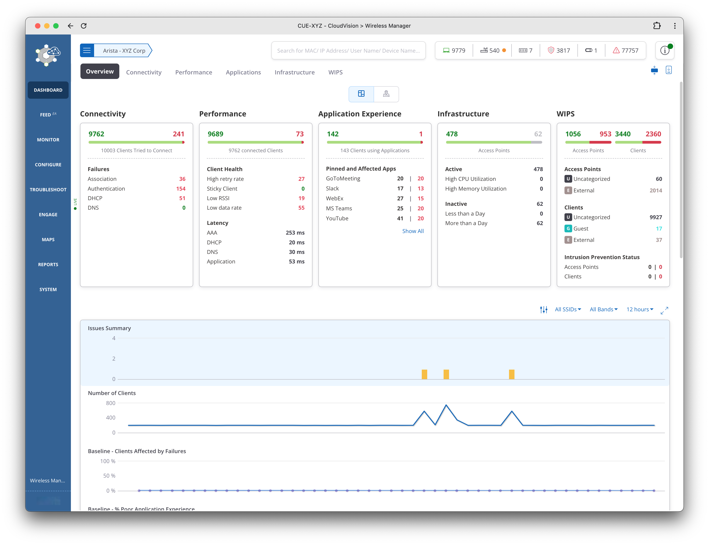

3. Use the left menu bar to select monitoring and configuration functions.

    

4. The primary menu navigation functions are the following:

      1. **Dashboard** - Alerts, Client Access, Infrastructure health, Application Experience, and WIPS
      2. **Monitor** - Monitor and explore Clients, APs, Radios, SSIDs, Application traffic, Tunnels
      3. **Configure** - WiFi SSIDs, APs and Radios, Tunnels, RADIUS, and WIPS settings
      4. **Troubleshoot** - Client connection test, packet trace, live debug logs, historic logging
      5. **Engage** - User insights, Presence, Usage, 3rd party integrations
      6. **Floor Plans** - Floor layouts and AP location map view
      7. **Reports** - Detailed information for Infrastructure APs/Radios, Client Connectivity and Experience, WIPS detections
      8. **System** - Locations Hierarchy, AP Groups, 3rd party server settings, keys and certificates

5. In addition to the menu bar navigation and Locations Hierarchy, the UI provides a common Search bar, Metric summary, and Help button throughout workflows.

    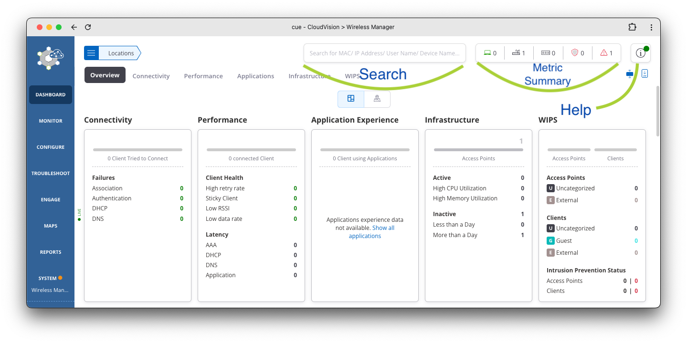

## Assign AP Name

Access points that successfully receive an IP address, DNS, and default gateway via DHCP, and have connectivity over HTTPS/TCP/443 to CV-CUE.

1. Using the left navigation bar in CV-CUE, navigate to `Monitor > WiFi`.

    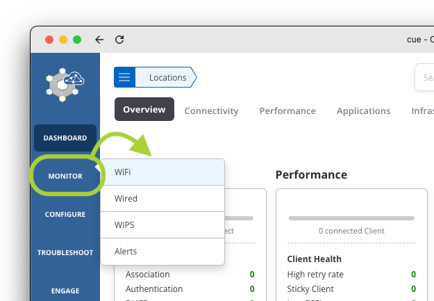{ width=600" }

2. Select the `Access Points` section and observe the discovered AP and default name `Arista_` and the last 3 bytes of the MAC address.

3. Customize the AP’s name by clicking the 3-dots menu and Rename

    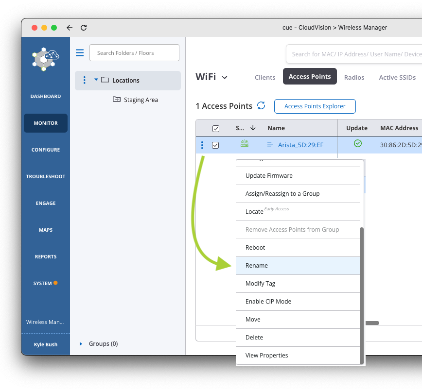{ width=600" }

4. Give the AP a name such as: `POD##-AP1` or `POD##-AP2` where ## is a 2 digit character between 01-12 that was assigned to your lab/Pod.

    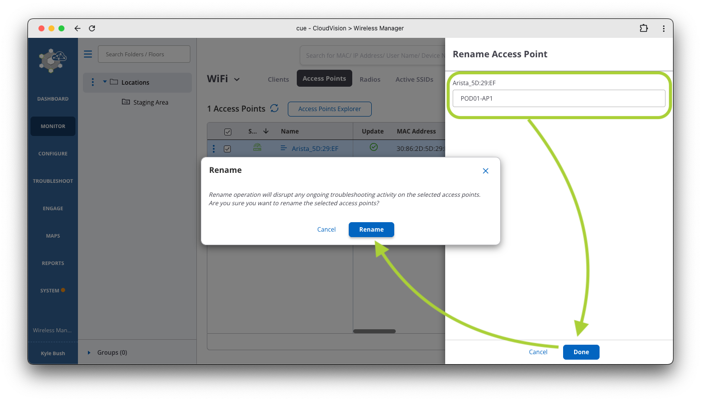

    

## Managing the Configuration Hierarchy

Within CV-CUE, much of the configuration is hierarchical, so everything you configure will be inherited from that level and it's children.

### Moving AP to Location

Expand the `Locations` pane by clicking on the hamburger icon :material-menu:. Now select the three dots :material-dots-horizontal: to the left of `Locations` and click on `Manage Navigator`.

{ width=600" }

1. `Manage Navigator` is where you create Folders, Floors, and Groups.
      1. **Folders** typically represent a company, branch office name or division.
      2. **Floors** are straightforward and are where maps are placed.
      3. **Groups** are a way to make a configuration more granular. Let’s say you want a branch location to have all of the same configuration but Outdoor APs need to vary from that. You would create a group for the Outdoor APs, put the APs into that group and override the part of the configuration that is unique. Think of your company and how you would want to lay it out.
2. Add a `Folder` for your Company Name. In the `Navigator`, select the 3 dots :material-dots-horizontal: next to `Locations`. Select `Add Folder/Floor`

    { width=600" }

3. Add a new folder using the settings below, depending on your student assignment

    ???+ example "Folder Name"

        | Student   | Folder Name |
        | --------- | :---------: |
        | Student1  |   `ACorp`   |
        | Student2  |   `ACorp`   |

    { width=600" }

4. Next, create a `Floor` called `1st Floor`.  Click on the word `A/BCorp` to expose the 3 dots menu.

    { width=600" }

    ??? tip "Add Multiple Floors"

        It’s also possible to add multiple floors at once using the `Add Multiple Folders/Floors` menu option

        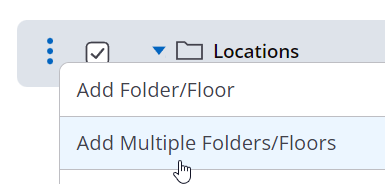
        

        *Use the `*` key to create floors instead of folders*

5. Next, move your AP into the `1st Floor` you created. To move your AP from the staging area, Alternate click on the `Staging Area` folder, and select `Show Available Devices`.

    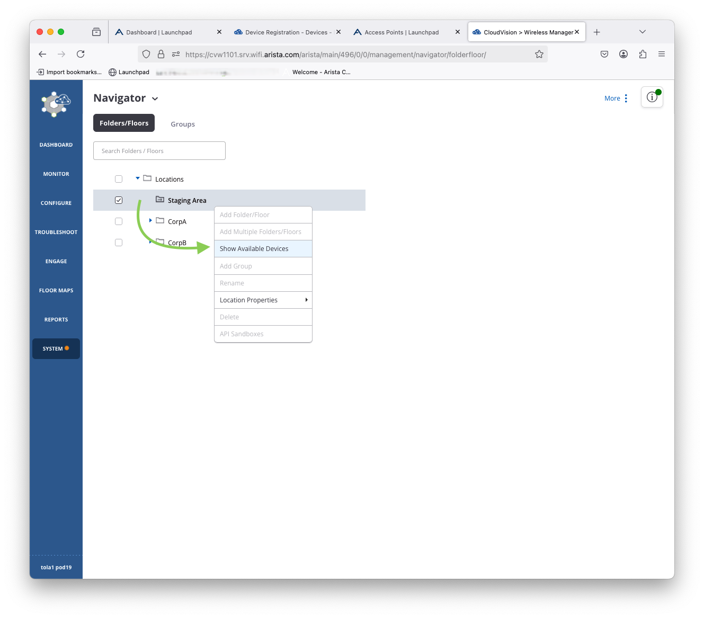

6. Next, right click on the AP name, select `Move` and then select the `1st Floor` folder you created earlier, and then click the `Move` button at the bottom of the screen.

    === "Step 1: AP Move"

        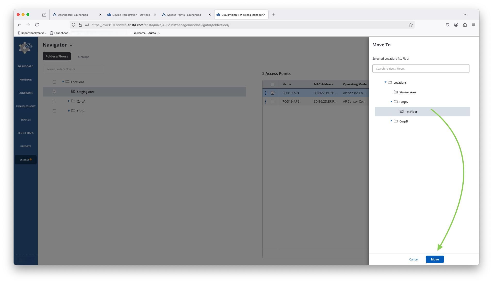

    === "Step 2: AP Move"

        

    === "Step 3: AP Move"

        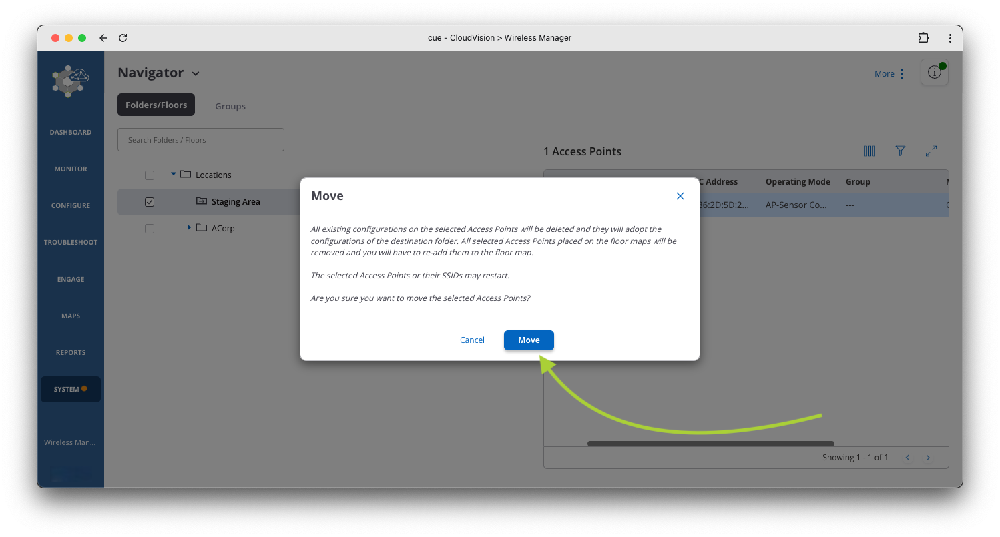

7. You’ll see a pop-up message to confirm the move. Click `Move` again to finish the process

8. You can verify the move by selecting the `1st Floor` folder and then `Show Available Devices`.

    

### Adjusting Power/Channels

For this workshop event, we will be reducing WiFi Radio channel width and transmit power levels to avoid interference with the hosting facility.

1. To customize these power settings:  Navigate to the `Configure > Device > Access Points` menu
2. Once in that menu, ensure that `ACorp` or `BCorp` is selected from the tree structure on the left. If you do not see the tree structure, click the hamburger icon next to `Locations` in the top left to expose the tree.

3. Set the following parameters under the `WiFi Radios` tab and `5GHz` (you can ignore 2.4GHz) and you will override the following:

    - Channel Selection: Select `Manual` and see the "Channel Settings" table below.
    - Channel Width: `20MHz`
    - Transmit Power: `Manual` to `4bBm`

    !!! warning "My settings are greyed out"

        At the bottom of your screen you may need to select to override the inheritance policy. It should state: `Click here to enable editing and customize the policy`.

    Find your pod number and assigned student number, set the `Candidate Channel`

    ???+ quote "All Channel Settings"

        |  Pod  | Student | 2.4 GHz  | 5.GHz | Channel Width | Transmit Power |
        | :---: | :-----: | :------: | :---: | :-----------: | :------------: |
        |  01   |    1    | Disabled |  36   |     20MHz     |      4bBm      |
        |  02   |    2    | Disabled |  44   |     20MHz     |      4bBm      |
        |  03   |    3    | Disabled |  52   |     20MHz     |      4bBm      |
        |  04   |    4    | Disabled |  60   |     20MHz     |      4bBm      |
        |  05   |    5    | Disabled |  100  |     20MHz     |      4bBm      |
        |  06   |    6    | Disabled |  108  |     20MHz     |      4bBm      |
        |  07   |    7    | Disabled |  120  |     20MHz     |      4bBm      |
        |  08   |    8    | Disabled |  128  |     20MHz     |      4bBm      |
        |  09   |    9    | Disabled |  136  |     20MHz     |      4bBm      |
        |  10   |    10   | Disabled |  144  |     20MHz     |      4bBm      |
        |  11   |    11   | Disabled |  153  |     20MHz     |      4bBm      |
        |  12   |    12   | Disabled |  161  |     20MHz     |      4bBm      |

4. Click `Save` at the bottom of the page then click `Continue` to confirm.
5. Click `Continue` to commit changes

### Assign Floor Plan

Let's assign a floor plan to our `1st Floor` for our respective corporation. Depending on the lab guide format, you can either save the image here or download from the email. We are going to use this image and import it into CV-CUE.

!!! info ":simple-materialformkdocs: Download MkDocs Site"

    If you are viewing this guide as a MkDocs site, simply right click the image below and `Save Image As` to your Desktop.

!!! info ":fontawesome-solid-laptop-code: Use your favorite snip program"

    On your Mac, `Command+Shitt+5` and snip the image here and save that image to your computer.
    On Windows, use your favorite snip program to capture the image below and save it to your computer.

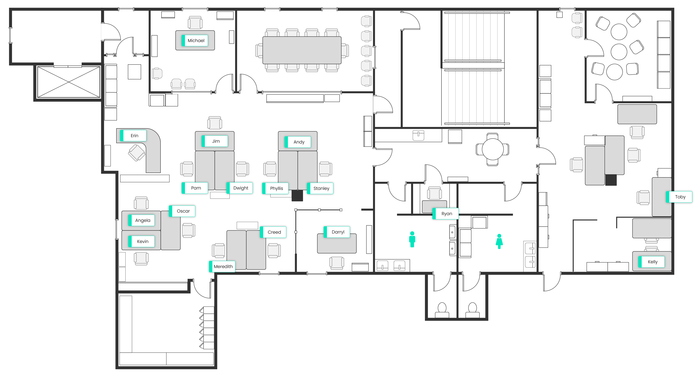

1. In the left hand menu, click on `Floor Maps`.  Make sure to set the location level to be `CorpA/B - 1st Floor`.  Click the `Add Floor Plan` button in the upper right corner of the screen.

    

2. Enter floor name as `1st Floor`, click the `Upload Image` button to import the floor plan image, and use the following dimensions:  Floor Plan Dimensions: Unit: Feet, Length: 120, Width: 60

    ???+ example "Floor Plan Settings"

        | Key    | Value |
        | ------ | :---: |
        | Unit   | Feet  |
        | Length |  120  |
        | Width  |  60   |

    

3. Click `Save` at the bottom of the screen.
4. Next, drag the AP onto the map, from the right hand side menu, to see how easy placing APs is. Choose `Place Access Points`.

    ???+ warning "I don't see my AP?"

        If you do not see an AP, it is because your AP is assigned to another location (folder) and you’ll need to move it to the `1st Floor` folder (see steps above). Or, you may have the incorrect menu selected in the upper right hand corner of the screen.

    

    ??? example "Screenshots"

        

        

5. Hover over the AP image to get more information and then `right-click on the AP` image to see more options.

    

    - 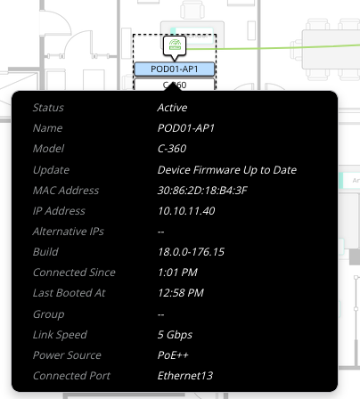
    - 

    

6. Next, explore the other menu options like `Start LED Blinking` (in the menu on the right hand side of the screen).

    

7. Try exploring the `Event Logs` under the `Troubleshoot` menu

## Creating a PSK SSID

The `Configure` section of CV-CUE is broken into several parts, including `WiFi`, `Device`,`Network Profiles`, `WIPS`, and `Alerts`.

In this section of the lab, we will be working in the `WiFi` configuration area. We will create an SSID with a WPA2 PSK for you CorpA/B site.

1. Hover your cursor over the `Configure` menu option on the left side of the screen, then click `WiFi`.

    

2. At the top of the screen, you will see where you are in the location hierarchy. Click on the three lines :material-menu: next to `Locations` to expand the hierarchy and choose/highlight the `CorpA` or `CorpB` folder. Now click the `Add SSID` button on the right hand side of the screen.

    === "Hierarchy Collapsed"

        

    === "Hierarchy Expanded"

        

3. Once on the `SSID` page, configuration sub-category menu options will appear across the top of the page related to WiFi (the defaults are `Basic`, `Security`, and `Network`). You can click on these sub-category names to change configuration items related to that area of the configuration.

4. To make additional categories visible, click on the 3 dots :material-dots-horizontal: next to `Network` and you can see the other categories that are available to configure (`Wifi7`,`Access Controls`, `Captive Portal`, etc.).

    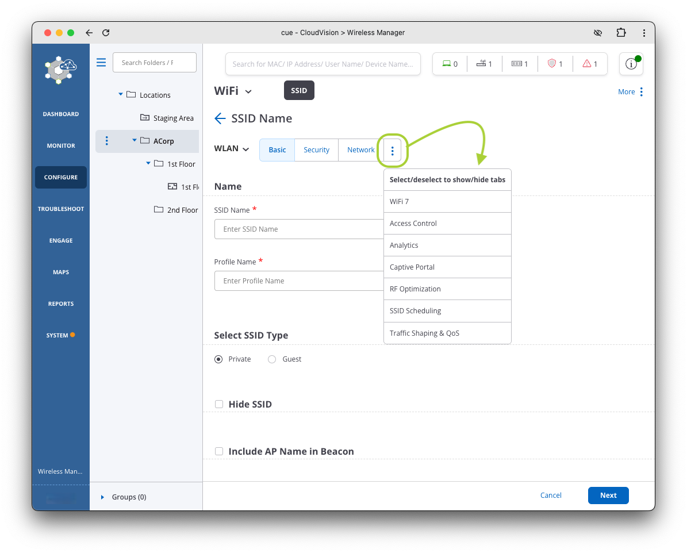

5. Walk through the steps (tabs) below to configure the SSID

    === "Step 1: SSIDBasic"

        In the `Basic` sub-category option, name the SSID `ATD-##A/B-PSK` (where ## is the pod number you were assigned).  The `Profile Name` is used to describe the SSID and should have been auto-filled for you.

        Since this is our corporate SSID, leave the `Select SSID Type` set to `Private`

        !!! tip "Guest SSID"

            Note: this is where you would change it to `Guest` if needed.

        

    === "Step 2: SSID Security"

        In the `Security` sub-category, change the following settings, then select `Next` at the bottom of the screen.

        

    === "Step 3: SSID Network"

        In the `Network` configuration sub-category, we’ll leave the `VLAN ID` set to `0`, which means it will use the native VLAN. If the switchport the AP is attached to is trunked, you could change this setting to whichever VLAN you want the traffic dropped off on.
        We are using `Bridged` mode in this lab. You could use the following for specific scenarios:

        1. `NAT`: often done for Guest
        2. `L2 Tunnel` / `L3 Tunnel`: as you would see for a Guest Anchor or tunneled corporate traffic

        

    ???+ example "SSID Name"

        | Student                       |   Student 1    |   Student 2    |
        | ----------------------------- | :------------: | :------------: |
        | SSID Name                     | `ATD-##-PSK`   | `ATD-##-PSK`   |
        | Profile Name                  |   Auto Fill    |   Auto Fill    |
        | Association Type (drop down)  |      WPA2      |      WPA2      |
        | Authentication (radio button) |      PSK       |      PSK       |
        | Passphrase                    | `Wireless!123` | `Wireless!123` |

6. The rest of the settings can be left at the default values.
7. Click the `Save & Turn SSID On` button at the bottom of the page.
8. You will be prompted to customize before enabling, check the `Customize` button

    

9. Only select the `5 GHz` option on the next screen (un-check the `2.4 GHz` box), then click `Turn SSID On`.

    

10. After you turn on the SSID, hover your cursor over `Monitor` in the left hand side menu, and then click `WiFi`.

    

11. Now, in the menu options at the top of the page, look at the `Radios` menu option. Is the 5 GHz radio :fontawesome-regular-thumbs-up: (Up) and 2.4 GHz radio :fontawesome-regular-thumbs-down: (down)?

    ???+ warning "It may take a minute or two for the radio to become active."

    

12. Next, go ahead and connect your phone to the SSID (PSK is `Wireless!123`).  Navigate to the `Clients` menu at the top of the screen and you should see your device.

    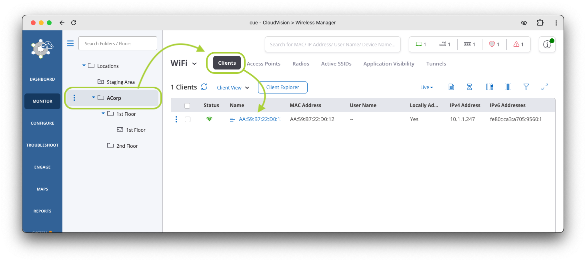

!!! tip "🎉 CONGRATS! You have completed this lab! 🎉"

    [:material-login: LET'S GO TO THE NEXT LAB!](./b02_lab.md){ .md-button .md-button--primary }

--8<-- "includes/abbreviations.md"
