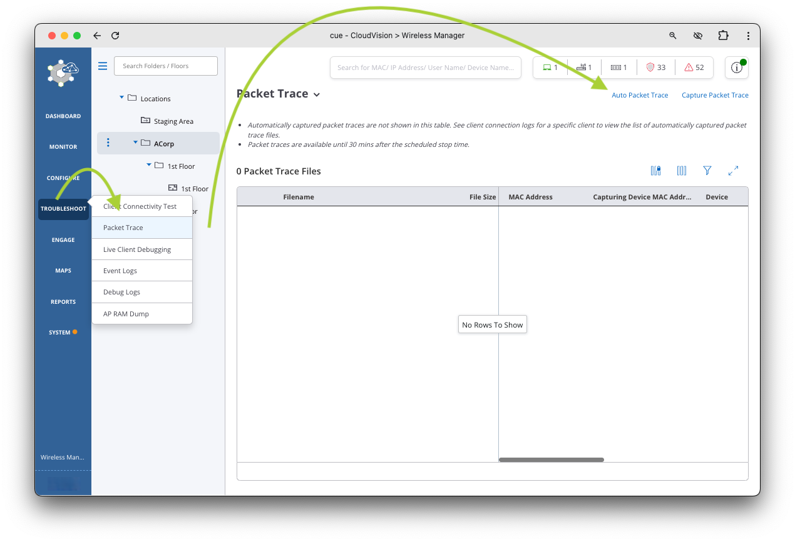
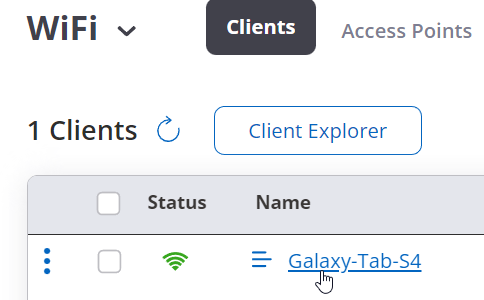

# B-02 | WiFi Troubleshooting

## Overview

Explore the wireless troubleshooting features.

## Client Troubleshooting

1. Make sure you are at your correct folder (`ACorp`  or `BCorp`) in the hierarchy
2. Hover over `Troubleshoot` in the left hand menu, then click `Packet Trace`.

    

3. On the top right hand side of the window, click `Auto Packet Trace` and select the checkbox for the SSID you created earlier (`ATD-##A-PSK`).

    

    

4. Click `Save` at the bottom of the window.

    ???+ warning "I don't see my AP?"

        If you don’t see the SSID listed, make sure you are in the correct folder in the navigation pane.

5. Next, connect your device to the AP and **type in the wrong PSK**.
6. Hover your cursor over the `Monitor` menu on the left hand side of the screen, then click `WiFi`.
7. Now click on `Clients` at the top of the page. You should see your device trying to connect.

    

8. Select on the three dots :material-dots-horizontal: next to the device name and select `Start Live Client Debugging`.

    

9. Select `30 Minutes` in the `Time Duration` drop down box, select the `Discard Logs` radio button, then click `Start`.

    

10. Next, try connecting the device again with the :octicons-x-circle-16: **Wrong PSK**. Watch and review the `Live Client Debugging` Log.

    

11. After that fails, try again with the :fontawesome-regular-circle-check: **correct PSK** (`Wireless!123`) and review the logs.
12. Once your device has successfully connected to the AP, click on the client name to learn more about the client (on the previous browser tab).

    

    - 
    - 

    

13. After you click on the client name you can gather additional information such as:
    1. Root Cause Analysis
    2. Client Events
    3. Data Rate
    4. Top Apps by Traffic
    5. Client Traffic Volume
    6. Application Experience
    7. etc.
14. Scroll down a little to the `Client Events` section select the icon to `Switch to Table View`.

    

15. Here you can see the success/failure messages, DHCP information, and other events.
16. Scroll down to the failed incorrect PSK entry and select `View Packet Trace` in the `Packet Capture` column (you may have to scroll to the right).

    

17. You should see a packet trace that you can download. Click on `View Packet Trace`.
18. Select `Open` to open the file right within CV-CUE or the Packets Application. You will be in the `Visualize` section of Packets.

    

19. You can also download the trace and view it with WireShark if you have it installed.

    

20. Click on `Time View` and `Frames` to look through the data and at the trace to see how Arista can help you troubleshoot.
21. Next, click on the back arrow icon to look at the “Analyze” feature.

    

22. Explore the `Analyze` feature by clicking on the various menu options and reviewing the data.

    

!!! tip "🎉 CONGRATS! You have completed this lab! 🎉"

    [:material-login: LET'S GO TO THE NEXT LAB!](./b03_lab.md){ .md-button .md-button--primary }
