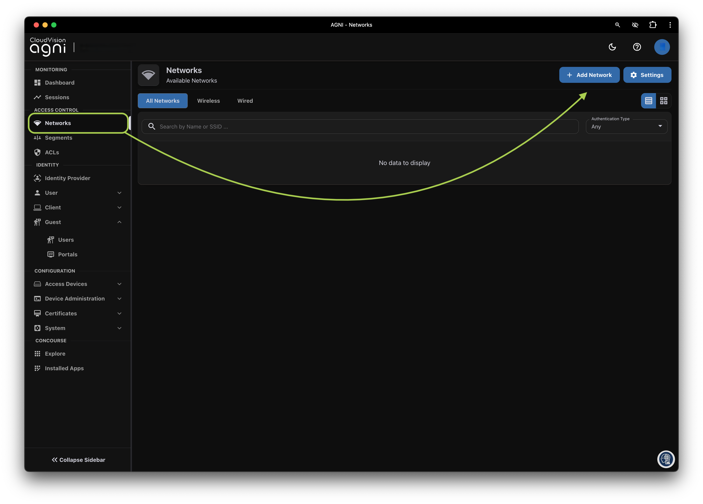
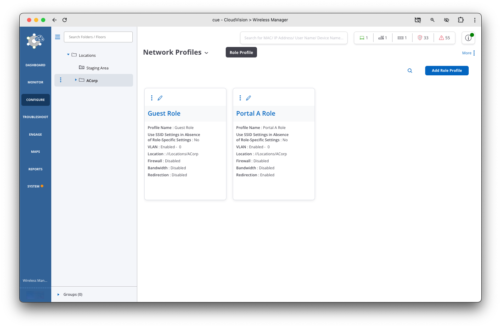
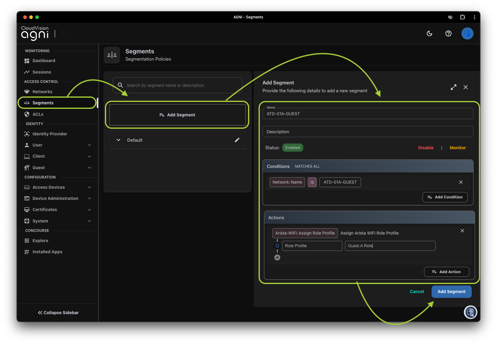
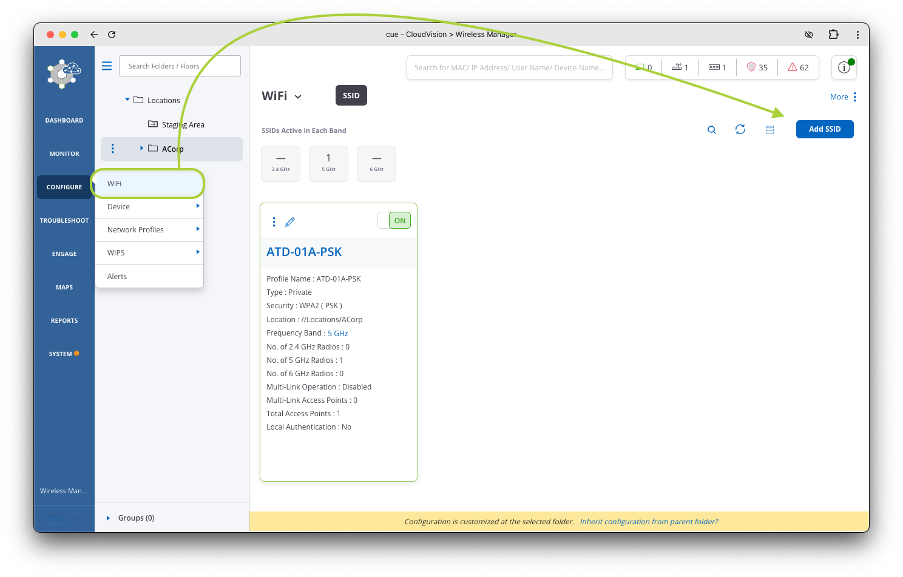
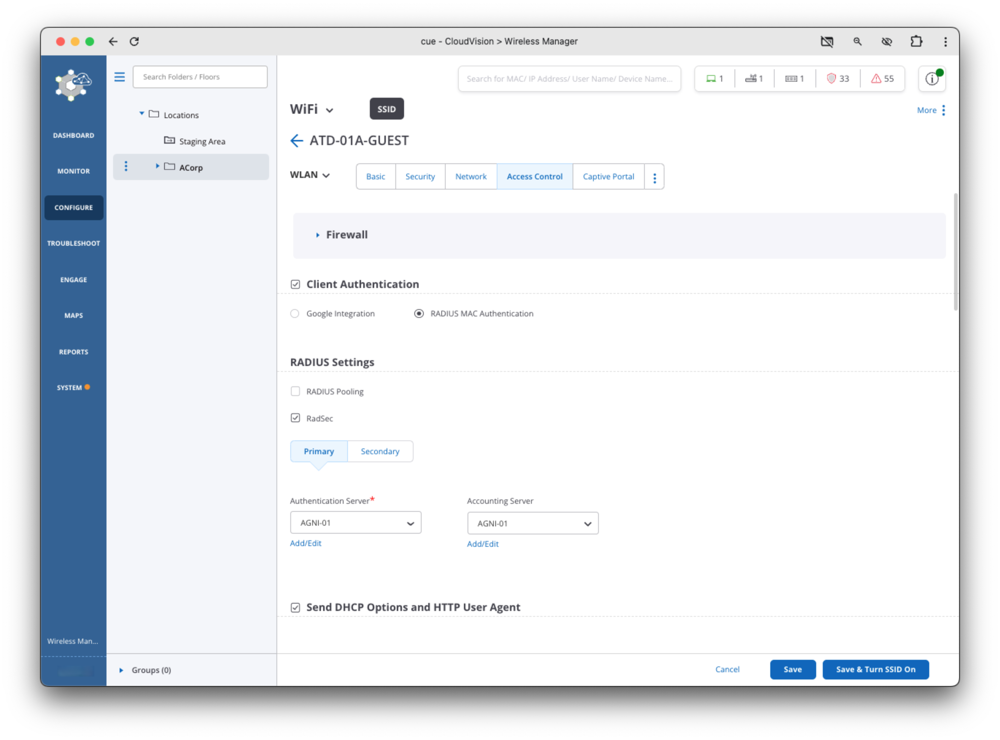
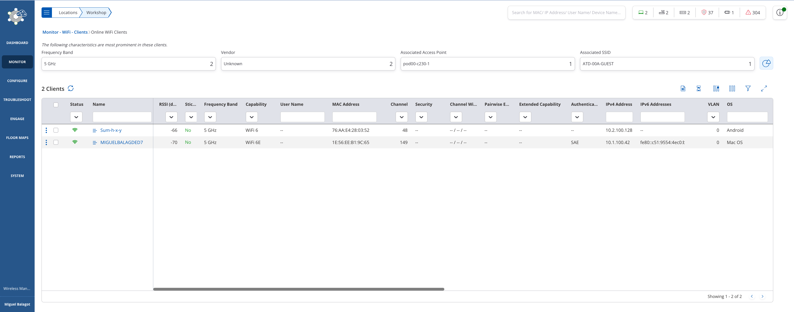
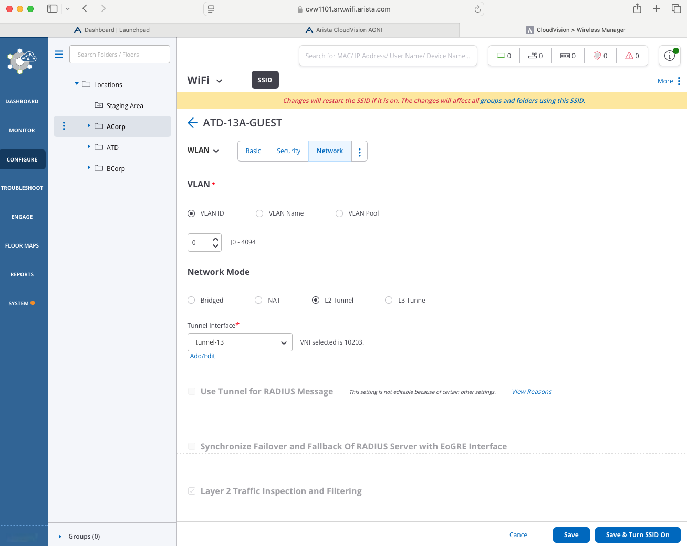
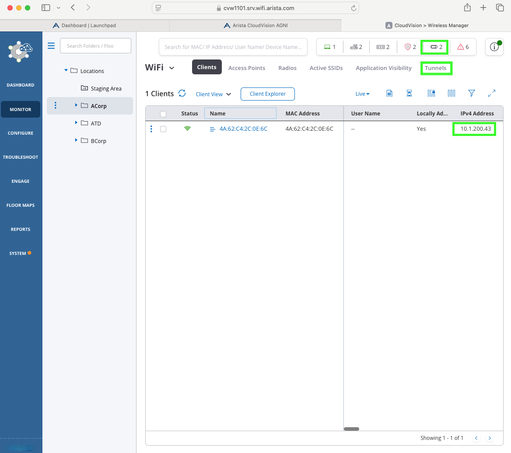
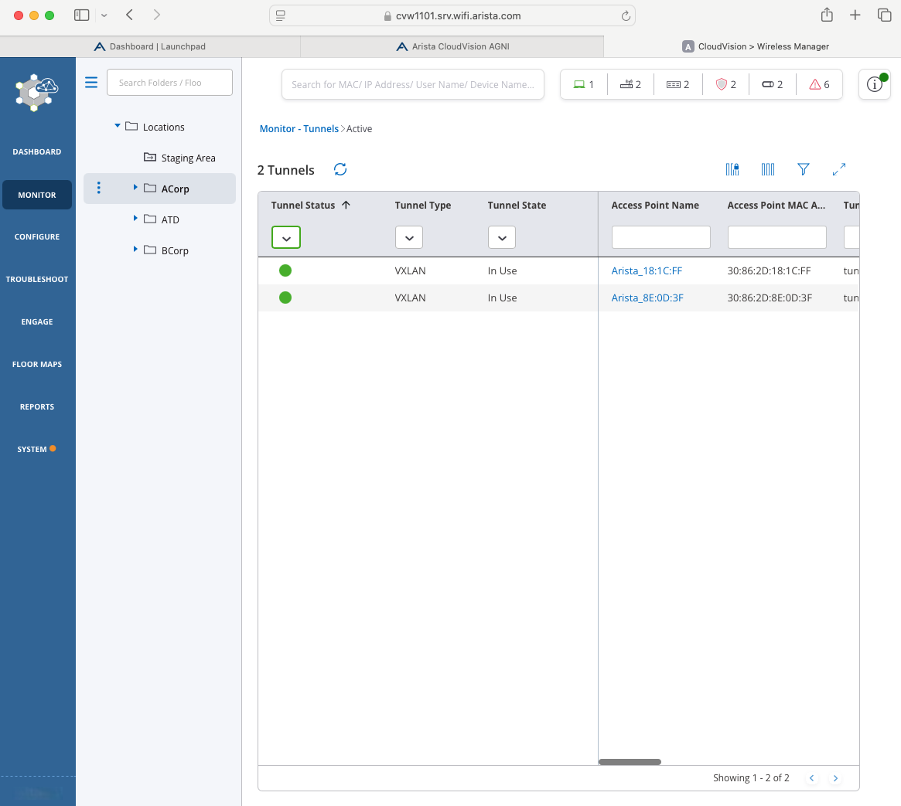

# B-03 | Guest Wireless with AGNI

## Overview

--8<--
docs/snippets/login_agni.md
--8<--

## AGNI Guest Captive Portal

Let's configure a Guest Captive Portal using AGNI for wireless clients. To configure the guest portal, you must configure both AGNI and CV-CUE.

??? tip "Important: Your access points need to be onboarded in AGNI with RadSec before proceeding. Follow the steps here"

    --8<--
    docs/references/radsec.md
    --8<--

1. Navigate to `Guest > Portals` under the section `Identity`.

    

2. Click `+ Add Guest Portal` and configure the following

    ???+ example "Network Settings"
        | Field                    |    Student 1    |    Student 2    |
        | ------------------------ | :-------------: | :-------------: |
        | Portal Name              | `ATD-##-GUEST` | `ATD-##-GUEST` |
        | Authentication Types     |  Clickthrough   |  Clickthrough   |
        | Re-Authuthenticate Guest |     Always      |     Always      |
        | CAPTCHA                  |    Disabled     |    Disabled     |

    

3. Click the Customization tab to customize the portal settings, and notice the elements. When done, click `Add Guest Portal`. The portal gets listed in the portal listing.

      - [x] Page
      - [x] Login Toggle
      - [x] Terms of Use and Privacy Policy
      - [x] Logo
      - [x] Guest Login Submit Button
      - [x] Etc

    

4. Click `Back`
5. Navigate to the `Networks` under the section `Access Control`. Click on `+ Add Network`

    

6. Add a new network with following settings

    ???+ example "Network Settings"
        | Field                                   |    Student 1    |    Student 2    |
        | --------------------------------------- | :-------------: | :-------------: |
        | Name                                    | `ATD-##-GUEST` | `ATD-##-GUEST` |
        | Connection Type                         |    Wireless     |    Wireless     |
        | SSID                                    | `ATD-##-GUEST` | `ATD-##-GUEST` |
        | Authentication Type                     | Captive Portal  | Captive Portal  |
        | Captive Portal Type                     |    Internal     |    Internal     |
        | Select Internal Portal                  | `ATD-##-GUEST` | `ATD-##B-GUEST` |
        | Internal Role for Portal Authentication | `Portal ## Role` | `Portal ## Role` |

    

7. Click `Add Network`.
8. Copy the portal URL at the bottom of the page.

    !!! tip "AGNI URL"

        Make sure to **copy the AGNI Guest Portal URL**, we are going to use this in CV-CUE for Guest Portal Redirection.

--8<--
docs/snippets/login_cvcue.md
--8<--

## Role Profile (CV-CUE)

Let's configure two role profiles and the SSID settings. This will ensure our guest SSID we will create is enabled with redirection to AGNI captive portal. These roles are

- Portal (A/B) Role: This role will be assigned initially to ensure captive portal redirection
- Guest (A/B) Role: This role will be assigned by AGNI to drop our client into a "Guest Role" where we can further define policy

### Portal Role Profile

1. Log in to CV-CUE and navigate to `Configure > Network Profiles > Role Profile`.

    

2. Add a `Role Profile` using the setting below

    ???+ example "Network Settings"
        | Field             |      Student 1       |      Student 2       |
        | ----------------- | :------------------: | :------------------: |
        | Role Name         |   `Portal ## Role`    |   `Portal ## Role`    |
        | Profile Name      |   `Portal ## Role`    |   `Portal ## Role`    |
        | Redirection       |       Enabled        |       Enabled        |
        | Redirection Type  |  Static Redirection  |  Static Redirection  |
        | Redirect URL      | `<Copied from AGNI>` | `<Copied from AGNI>` |
        | HTTPS Redirection |       Enabled        |       Enabled        |
        | Common Name       |    www.arista.com    |    www.arista.com    |
        | Organization      |   Arista Networks    |   Arista Networks    |
        | Organization Unit |   Arista Networks    |   Arista Networks    |

    

3. Click `Save` at the bottom of the page.

### Guest Role Profile

Next, we’ll configure a Guest Role in CV-CUE to assign to Guest Users post authentication.

1. In CV-CUE, navigate back to `Configure > Network Profiles > Role Profile`.

2. Click `Add Role Profile`.

3. Add the `Role Name` as follows, this role is simple, but see the [additional information](#additional-information) below to explore some of the options you have with roles.

    ???+ example "Network Profiles"
        | Field     |   Student 1    |   Student 2    |
        | --------- | :------------: | :------------: |
        | Role Name | `Guest ## Role` | `Guest ## Role` |

    

4. Click `Save` at the bottom of the page
5. You should now have two roles, we will refer back to these roles in both the AGNI and CUE SSID configuration.

    

### Additional Information

- :material-arrow-split-vertical:{ .lg .middle } **VLAN**

    ---

    In this lab the VLAN is set to 0. In production networks you would define the Guest VLAN ID or Name that you want to assign to the Guest Users.

- :material-wall:{ .lg .middle } **Firewall**

    ---

    Layer 3-4 and Application Firewall Rules can be assigned to the Guest User Role.

- :fontawesome-solid-gauge-high:{ .lg .middle } **User Bandwidth Control**

    ---

    Upload and Download Bandwidth Limits can be assigned to the Guest User Role.

## Portal Segment (AGNI)

Next, we’ll configure a Segment in AGNI to assign the Guest Role Profile post authentication.

1. Go back to AGNI and navigate to the Access Control > Segments.
2. Add a new Segment by clicking on `+ Add Segment`

    !!! note "Conditions for segments must MATCH ALL conditions line by line."

    ???+ example "Network Settings"
        | Field               |             Student 1             |             Student 2             |
        | ------------------- | :-------------------------------: | :-------------------------------: |
        | Name                |          `ATD-##-GUEST`           |          `ATD-##-GUEST`           |
        | Condition           |  `Network:Name is ATD-##-GUEST`   |  `Network:Name is ATD-##-GUEST`   |
        | Action              | `Arista-WiFi:Assign Role Profile` | `Arista-WiFi:Assign Role Profile` |
        | Action Role Profile |          `Guest ## Role`          |          `Guest ## Role`          |

    

3. Click `Add Segment` at the bottom of the page.
4. Let's now add the Guest SSID

## Guest Portal SSID (CV-CUE)

Lastly, we’ll configure and enable the Guest Captive Portal SSID and assign the pre and post authentication roles.

1. Let's navigate back to CV-CUE
2. Select Correct location `ACorp` (student 1) or `BCorp` (student 2)

    !!! warning "CV-CUE Locations"

        Reminder, make sure you have selected your appropriate corporation before creating the SSID!

3. Navigate to `Configure > WiFi` and click on `Add SSID`

    

4. Configure the SSID `Basic` settings using the settings below

    ???+ example "SSID Basic Settings"

        | Setting   |    Student 1    |    Student 2    |
        | --------- | :-------------: | :-------------: |
        | SSID Name | `ATD-##-GUEST`  | `ATD-##-GUEST`  |
        | SSID Type |     Private     |     Private     |

    

5. Click the 3 dots and select `Access Control` tab and configure using the settings below

    ???+ example "SSID Access Control Settings"

        | Setting                               |           Value           | Notes                                     |
        | ------------------------------------- | :-----------------------: | ----------------------------------------- |
        | **Client Authentication**             |  :octicons-checkbox-16:   |                                           |
        | Authentication Type                   | Radius MAC Authentication |                                           |
        | **RadSec**                            |  :octicons-checkbox-16:   |                                           |
        | Authentication Server                 |         `AGNI-01`         | AGNI Radsec Server was configured already |
        | Accounting     Server                 |         `AGNI-01`         |                                           |
        | **Role Based Control**                |  :octicons-checkbox-16:   |                                           |
        | Rule Type                             |    802.1X Default VSA     |                                           |
        | Operand                               |           Match           |                                           |
        | Assign Role                           |        Select All         | Created in previous section               |
        | Send DHCP Options and HTTP User Agent |  :octicons-checkbox-16:   |                                           |

    

    

6. Once all settings have been set, Click the `Save & Turn SSID On` button at the bottom of the page.
7. You will be prompted to customize before enabling, select the `5 GHz` option on the next screen (un-check the `2.4 GHz` box if it’s checked), then click `Turn SSID On`.

    

8. Join the new WiFi and verify connectivity in CUE and AGNI

    !!! tip "Join the guest WiFi!"

        Give it a moment for the new SSID to come up, but once it's up try and join the WiFi! You should be prompted with a captive portal, click on the a

    === "CV-CUE"

        Navigate to `Monitor > Clients` in CV-CUE

        { width="500" }

    === "AGNI"

        Navigate to `Sessions` in AGNI

        { width="500" }

## Tunneling Guest Traffic

To highlight Arista's Controller-less Architecture we will use the labs spine MLAG switches to terminate the AP tunnel with VXLAN configured and tunnel guest traffic.

### Create Tunnel Profile (CV-CUE)

1. Under the `Configure` section, click on `Network Profiles > Tunnels`
2. Select the correct location in your hierarchy
3. Select `Add Tunnel Interface`

    ???+ "Network Profiles"

        | Setting                       |          Value          |
        | ----------------------------- | :---------------------: |
        | Tunnel Interface Name         |       tunnel-##         |
        | Tunnel Type                   |        `VXLAN`          |
        | Remote Endpoint               |        1.1.1.1          |
        | Local Endpoint VLAN           |           0             |
        | VXLAN VNI Offset              |         10200           |

4. Click `Save`

    

### Assign SSID to Tunnel Profile

1. Under the `Configure` section, click on `WiFi`
2. Select the correct location in your hierarchy
3. Select the pencil to edit Guest SSID
4. Select `Network`
5. Change `Network Mode` to `L2 Tunnel`
6. Select the tunnel-##
7. Click Save

    

## Monitor Tunnels

1. Under the `Monitor` section, click on `WiFi`
2. Verify your location in the hierarchy
3. Click on `Tunnels` or the tunnel icon on the top row

    !!! note "Notice the client IP Address is now using network 10.1.200.##"

        

4. Verify if the Tunnels are green

    

### Review VXLAN on spine1 or spine2 in CVaas

Screenshot shows VLAN200 mapped to VNI10200 and VXLAN clients with VLAN200 IPs

   

!!! tip "🎉 CONGRATS! You have completed this lab! 🎉"

    [:material-login: LET'S GO TO THE NEXT LAB!](./b04_lab.md){ .md-button .md-button--primary }
