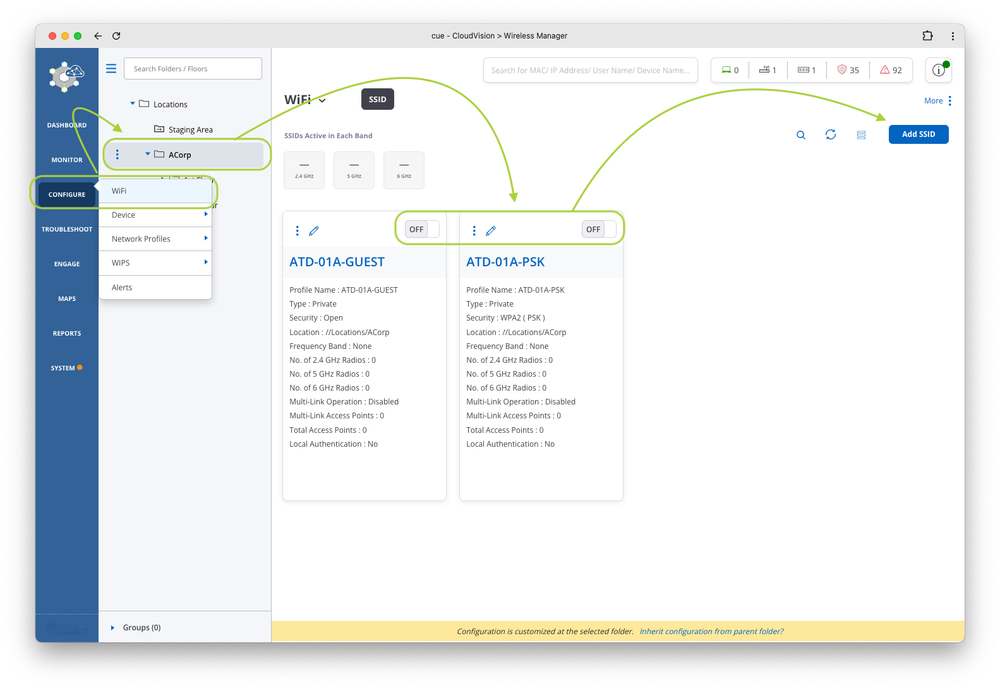
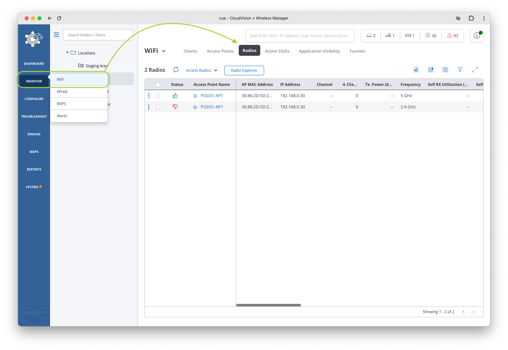
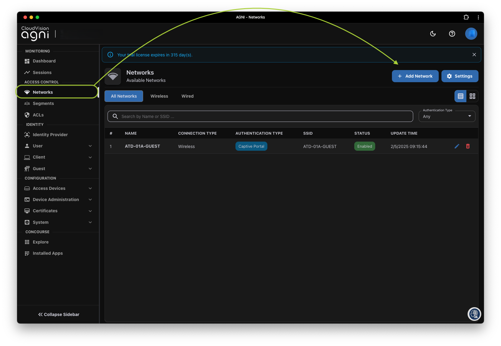
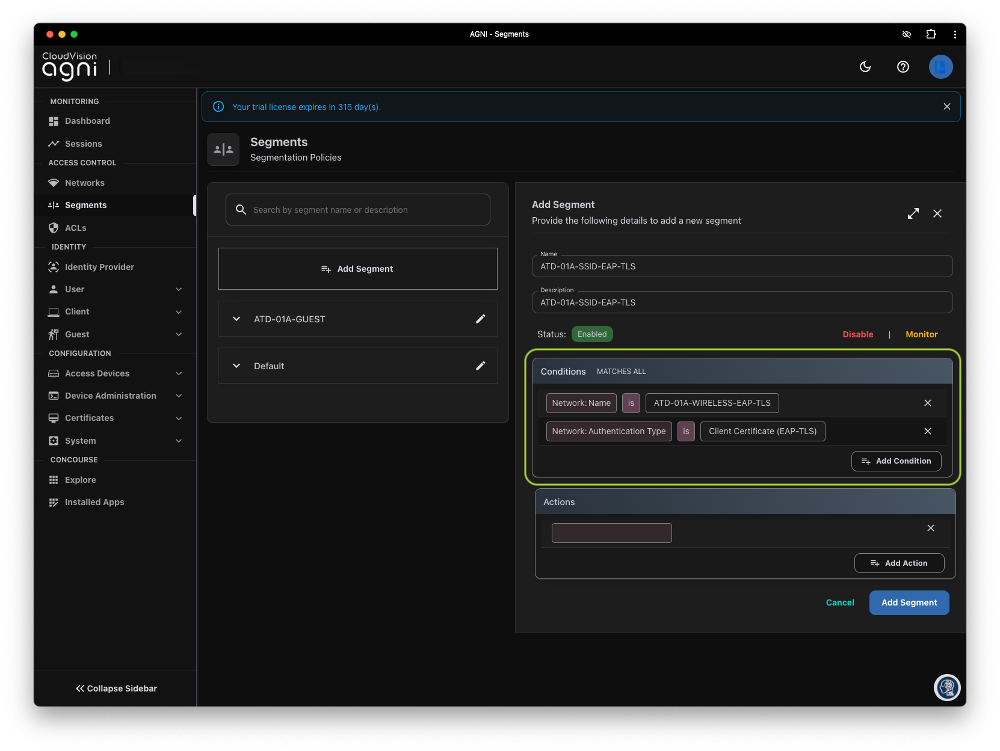

# C-01 | AGNI and WiFi EAP-TLS 802.1X

## Overview

In this lab we will be working within the `WiFi` configuration section of CV-CUE. Create an SSID (WPA2 802.1X) with your `ATD-##-EAP` as the name (where ## is a 2 digit character between 01-12 that was assigned to your lab/Pod).

--8<--
docs/snippets/login_cvcue.md
--8<--

## Create an EAP-TLS SSID

The `Configure` section of CV-CUE is composed of multiple parts, including WiFi, Alerts, WIPS, etc. In this lab we are focused on the `WiFi` section.

!!! tip "Other configuration sections"
    - **Alerts:** Where syslog and other alert related settings are configured
    - **WIPS:** Where the policies are configured for the WIPS sensor.

1. Let's go through the steps to create a new SSID

    === "Step 1"

        Hover your cursor over the `Configure` menu option on the left side of the screen, then click `WiFi`

        

    === "Step 2"

        At the top of the screen, you will see where you are in the location hierarchy. Click on your respective `Corp` (`ACorp` or `BCorp`),

        

        !!! tip "Expand Hierarchy"

            If you do not see the hierarchy, click on the three lines :material-menu: next to `Locations` to expand choose/highlight the appropriate `Corp` folder.

    === "Step 3"

        Let's disable the previous SSIDs from the prior labs bey toggling the `On/Off` button

        

    === "Step 4"

        Now click the `Add SSID` button on the right hand side of the screen.

        

2. Once on the “SSID” page, configuration sub-category menu options will appear across the top of the page related to WiFi (the defaults are `Basic`, `Security`, and `Network`). You can click on these sub-category names to change configuration items related to that area of the configuration.

3. To make additional categories visible, click on the 3 dots next to `Network` and you can see the other categories that are available to configure (`Analytics`, `Captive Portal`, etc.).

4. In the `Basic` sub-category option, name the SSID using the settings below. The `Profile Name` is used to describe the SSID and should have been auto-filled for you.

    ???+ example "Settings"

        | Student   |     Name      |
        | --------- | :-----------: |
        | Student 1 | `ATD-##A-EAP` |
        | Student 2 | `ATD-##B-EAP` |

        *where ## is a 2 digit character between 01-12 that was assigned to your lab/Pod*

    

5. Since this is our corporate SSID, leave the `Select SSID Type` set to `Private`
6. Select `Next` at the bottom.
7. In the `Security` sub-category, set the following select `WPA2` and change the association type to “802.1X”.

    ???+ example "Settings"

        | Field                 |      Value      |
        | --------------------- | :-------------: |
        | Security Method       |  WPA2 / 802.1X  |
        | Radius Settings       | Select `RadSec` |
        | Authentication Server |    `AGNI-##`    |
        | Accounting Server     |    `AGNI-##`    |

    

8. Select `Next` at the bottom of the screen.
9. In the `Network` configuration sub-category, we’ll leave the `VLAN ID` set to `0`, which means it will use the native VLAN. If the switchport the AP is attached to is trunked, you could change this setting to whichever VLAN you want the traffic mapped to. The rest of the settings can be left at the default values.

    !!! note "Alternative Settings"

        Instead of `Bridged` You could use `NAT` (often done for Guest) or `L2 Tunnel` / `L3 Tunnel`, as we completed in the wireless lab.

    

10. Click the `Save & Turn SSID On` button at the bottom of the page.
11. Only select the `5 GHz` option on the next screen (deselect the 2.4 GHz box if it’s checked), then click `Turn SSID On`.

    

12. After you turn on the SSID, hover your cursor over `Monitor` in the left hand side menu, and then click `WiFi`.
13. Now, in the menu options at the top of the page, look at the `Radios` menu option. Is the 5 GHz radio :fontawesome-regular-thumbs-up: (Up) and 2.4 GHz radio :fontawesome-regular-thumbs-down: (down)? It may take a minute or two for the radio to become active.

    

14. Check the `Active SSIDs` menu at the top of the screen. Is your SSID listed?

    

15. Now that we have a 802.1X backed SSID, let's go to AGNI to configure the policy.

## CloudVision AGNI Access

--8<--
docs/snippets/login_agni.md
--8<--

## Create AGNI Networks & Segments for the EAP-TLS Wireless Policy

1. Click on `Networks` and select `+ Add Network`

    

2. Configure the network with the following settings

    ???+ example "Network Settings"
        | Field               |          Student 1           |          Student 2           |
        | ------------------- | :--------------------------: | :--------------------------: |
        | Name                |    `ATD-##A-SSID-EAP-TLS`    |    `ATD-##B-SSID-EAP-TLS`    |
        | Connection Type     |           Wireless           |           Wireless           |
        | SSID                |        `ATD-##A-EAP`         |        `ATD-##B-EAP`         |
        | Authentication Type | Client Certificate (EAP-TLS) | Client Certificate (EAP-TLS) |

    

3. Click on `Add Network` at the bottom of the screen.
4. Next, click on `Segments` and then `+ Add Segment`

    

5. Configure the segment with the following settings

    ???+ example "Network Settings"
        | Field       |       Student 1        |       Student 2        |
        | ----------- | :--------------------: | :--------------------: |
        | Name        | `ATD-##A-SSID-EAP-TLS` | `ATD-##B-SSID-EAP-TLS` |
        | Description | `ATD-##A-SSID-EAP-TLS` | `ATD-##B-SSID-EAP-TLS` |

    

6. Next, let’s add two conditions to match the network we've defined (tied to the SSID) and the authentication type

    !!! note "Conditions"

        Conditions for segments must MATCH ALL conditions line by line.

    1. Select, `Network`, `Name`, `is`, `ATD-##X-SSID-EAP-TLS` from the drop down lists. Chose your `A` or `B` policy accordingly.
    2. Select, `Network`, `Authentication Type`, `is`, `Client Certificate (EAP-TLS)` from the drop down lists.
    3. Your Conditions should now look like this.

    

7. Under Actions select `Add Action` and select `Allow Access`

    

8. Finally, select `Add Segment` at the bottom of the page.

9. You should now be able to expand and review your segment.

    

10. Next, click on `Sessions` to see if your ATD Raspberry Pi has a connection via the Wireless connection.

    !!! note "Client Connectivity"

        The Client Certificate has already been applied to the Raspberry Pi and is configured to connect to the SSID ATD-##A-EAP.

    

11. Click on the session and explore the information we learn about the client, we're going to come back to this in more detail later.

    

12. If you don’t see any new sessions within 2 minutes AGNI, power cycle the Raspberry Pi.

!!! tip "🎉 CONGRATS! You have completed this lab! 🎉"

    [:material-login: LET'S GO TO THE NEXT LAB!](./c02_lab.md){ .md-button .md-button--primary }

--8<-- "includes/abbreviations.md"
