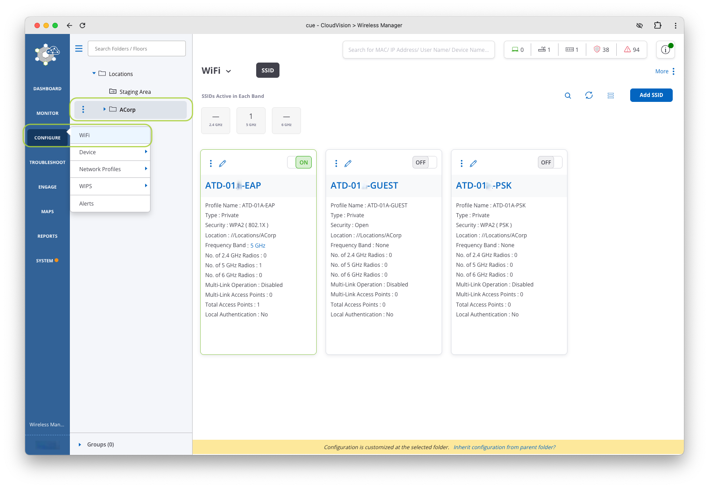

# C-02 | AGNI UPSK Wireless Policy

## Overview

In this lab we're going to explore the power of Unique Pre-Shared Keys (UPSK),

--8<--
docs/snippets/login_cvcue.md
--8<--

## Create Identity UPSK SSID

Let's create our new UPSK SSID by copying/modifying the PSK SSID we created in the CV-CUE lab.

1. While on your `CorpA` folder, Click on `Configure` and then `WiFi`

    

2. Next, click on the :material-dots-horizontal: and select `Create a Copy` on your specific SSID

    ???+ example "Your SSID"

        | Student   |     Name      |
        | --------- | :-----------: |
        | Student 1 | `ATD-##-PSK`  |
        | Student 2 | `ATD-##-PSK`  |

    *where ## is a 2 digit character between 01-12 that was assigned to your lab/Pod*

    

3. Select `Currently Selected Folders` and then `Continue`.

    

4. Click on the new SSID and select `Edit` :octicons-pencil-24:

    

5. On the `Basic` Tab rename the SSID to the following

    ???+ example "Settings"

        | Student      |   Student 1    |   Student 2    |
        | ------------ | :------------: | :------------: |
        | Name         | `ATD-##-UPSK`  | `ATD-##-UPSK`  |
        | Profile Name | `ATD-##-UPSK`  | `ATD-##-UPSK`  |

    

6. Next, click on the `Security` tab and configure the following

    !!! tip "UPSK Information"

        For more information on UPSK visit the article on [Unique PSK](https://arista.my.site.com/AristaCommunity/s/article/Unique-PSKs){target="_blank"}

    ???+ example "Settings"

        | Field                |    Value    |
        | -------------------- | :---------: |
        | Security Method      | WPA2 / UPSK |
        | UPSK Identity Lookup |   Enabled   |

    

7. Next, click on the `Access Control` tab and configure the following

    ???+ example "Settings"

        | Field                   |             Value             |
        | ----------------------- | :---------------------------: |
        | Radius Settings         |        Select `RadSec`        |
        | Authentication Server   |           `AGNI-##`           |
        | Accounting Server       |           `AGNI-##`           |
        | Username and Password   | MAC Address without Delimiter |
        | Call Station ID         |            `%m-%s`            |
        | Change of Authorization |            Enabled            |

    

8. Finally, `Save and turn on the SSID` and `Save SSID`

    

9. Only select the `5 GHz` option on the next screen (deselect the 2.4 GHz box if it’s checked), then click `Turn SSID On`.

    

--8<--
docs/snippets/login_agni.md
--8<--

## Create UPSK Network and Segment

In this section we are going to configure AGNI for our new SSID network and apply segmentation policy to enforce UPSK.

1. Click on `Networks` and then `+ Add Network`.

    

2. Add the following:

    ???+ example "Settings"

        | Field               |     Student 1     |     Student 2     |
        | ------------------- | :---------------: | :---------------: |
        | Name                |  `ATD-##-UPSK`    |  `ATD-##-UPSK`    |
        | Connection Type     |     Wireless      |     Wireless      |
        | SSID                |  `ATD-##-UPSK`    |  `ATD-##-UPSK`   |
        | Authentication Type | Unique PSK (UPSK) | Unique PSK (UPSK) |

    

3. Finally, click `Add Network`
4. You should now see this listed in your `Networks`.

    

5. Next, we will add the Segment.
6. Under Access Control, click on `Segments` and then `+ Add Segment`

    

7. Configure the following:

    !!! note "Segment Conditions"

        If there are multiple conditions, they must MATCH ALL.

    ???+ example "Settings"

        | Field        |               Student 1               |               Student 2               |
        | ------------ | :-----------------------------------: | :-----------------------------------: |
        | Name         |            `ATD-##-UPSK`              |            `ATD-##-UPSK`              |
        | Description  |            `ATD-##-UPSK`              |            `ATD-##-UPSK`              |
        | Condition #1 |    `Network:Name is ATD-##-UPSK`      |    `Network:Name is ATD-##-UPSK`      |
        | Condition #2 | `Network:Authentication Type is UPSK` | `Network:Authentication Type is UPSK` |
        | Action #1    |            `Allow Access`             |            `Allow Access`             |

    

8. Finally, click on `Add Segment`.
9. You should now see your new segment in the list of segments.

    

## Enroll Personal Device with Local User

In this section you will create a local user and enroll the MAC of your device.

1. In AGNI, under `Identity`, click on `User` and then `+ Add User`.

    

2. Fill out the fields for a new user

    ???+ example "Settings"

        | Field                                   |     Student 1     |     Student 2     |
        | --------------------------------------- | :---------------: | :---------------: |
        | Name                                    | whatever_you_want | whatever_you_want |
        | UserId                                  | whatever_you_want | whatever_you_want |
        | Password                                |   `Arista!123`    |   `Arista!123`    |
        | User must change password at next login |     Disabled      |     Disabled      |

    

3. Click `Add User`
4. You will notice that `Password` has now changed to `UPSK Passphrase`

    

5. Copy and write down or save to text file the new UPSK Passphrase.
6. Next, connect your client to `ATD-##A/B-UPSK` using your UPSK Passphrase.
7. Click on `Sessions` and validate your device connection.

    

8. Next, validate your device by clicking on `User` and then `Users`. Select your user.

    

9. Click on `Show Clients`

    

## Create an AGNI Client Group

In this section, you will simulate your device as an IoT device.

1. Disable and forget previously saved lab networks so your wireless connection on your test device does not auto connect.
2. In AGNI under your `User Clients` list, `Delete` your `Device`.

    

3. Next, you will add your client device as an IoT device in a Client Group.
4. First, we will need to create the Client Group.
5. In AGNI, under `Identity`, click on `Clients > Client Groups` and then `+ Add Client Group`.
6. Configure the following

    ???+ example "Settings"

        | Field                                   |        Student 1         |        Student 2         |
        | --------------------------------------- | :----------------------: | :----------------------: |
        | Name                                    | `CorpA Approved Devices` | `CorpA Approved Devices` |
        | Description                             | `CorpA Approved Devices` | `CorpA Approved Devices` |
        | User Association                        |   Not user associated    |   Not user associated    |
        | Group UPSK                              |         Enabled          |         Enabled          |

7. `Copy` the UPSK Passphrase and click on `Add Group`
8. Next, connect your client to ATD-##-UPSK using the Client Group UPSK Passphrase.
9. Click on `Sessions` and validate your device connection.

    <!-- { width="300px" } -->

10. Next Click on your `Client`.

    <!-- { width="300px" } -->

11. Notice your Client Group. Here you have the option to change the Client Group your device belongs to.

!!! tip "🎉 CONGRATS! You have completed this lab! 🎉"

    [:material-login: LET'S GO TO THE NEXT LAB!](./c03_lab.md){ .md-button .md-button--primary }

--8<-- "includes/abbreviations.md"
