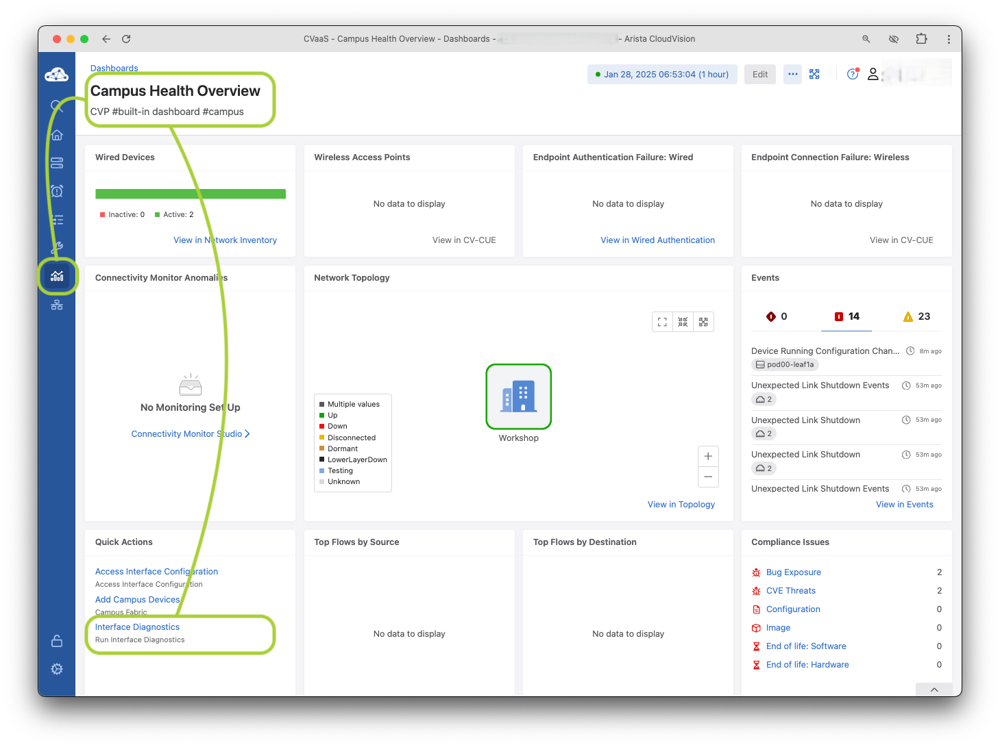
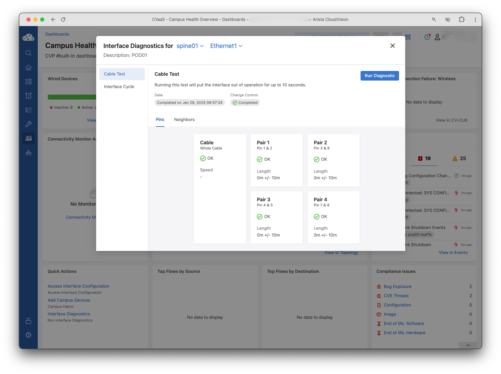
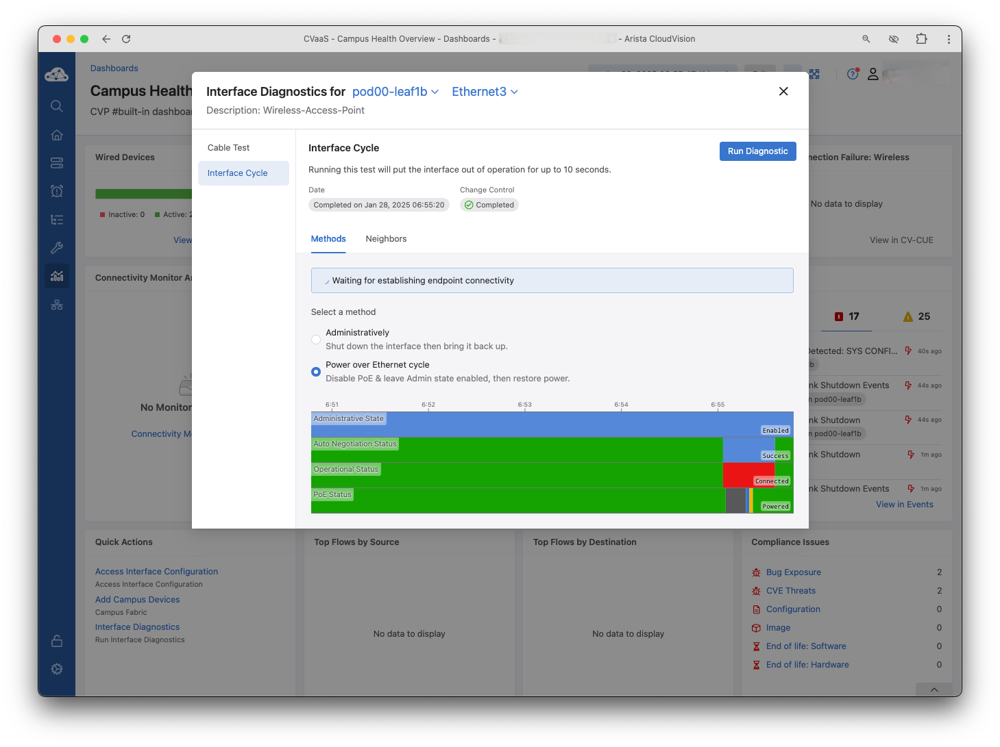

# CLoudVision Interface Diagnostics

## Overview

The CloudVision Campus features are targeted at streamlining Campus operations, interface diagnostics are no exception to this! You have tools at your fingertips to troubleshoot wired endpoints.

## Cable Test

Test your ethernet run between your devices or down to a connected endpoint like a desktop, phone, printer, etc. This can be helpful in validating the ethernet pairs are operating as expected, the length of the cable is not beyond specs, and you are able to transfer expected speeds.

## Interface Cycle

### Admin Down

Sometimes in troubleshooting a good bounce of the port will assist in triggering and endpoint to reauthenticate, power cycle, etc. Using the `Administratively` option to admin down the port and back up is an easy way to execute this action

### PoE Cycle

There are situations where you simply want a PoE device to power cycle. Use the `Power over Ethernet cycle` to quickly reboot any PoE device.

## Telemetry

We have telemetry data as you've seen throughout CloudVision and as expected, you are presented with relevant telmetry as these interfaces are tested. You can see here what the various cycles look like 

