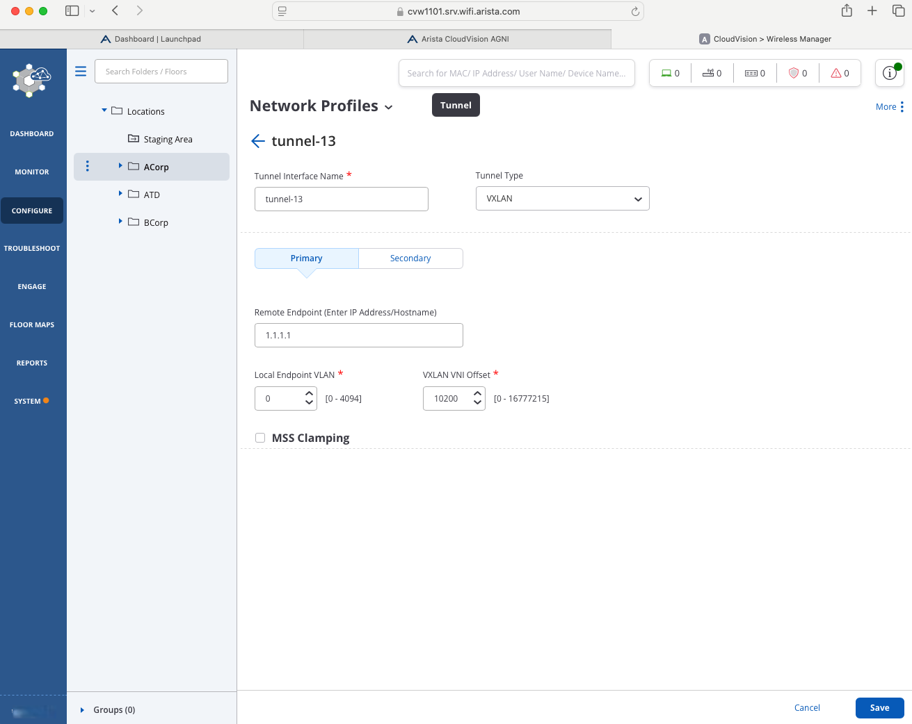

# Tunnel Guest Traffic to Core Switch

## Overview

To highlight Arista's Controllerless Architecture we will use the labs Core 720DP switch to termainate AP tunnels via VXLAN.

## Tunnel Configuration

### Arista CV-CUE

Login into CV-CUE to begin this lab, you will create the AP tunnel.

1. Under the `Configure` section, click on `Network Profiles > Tunnels`
2. Select the correct location in your hierarchy
3. Select `Add Tunnel Interface`

    ???+ "Network Profiles"

        | Setting                       |          Value          |
        | ----------------------------- | :---------------------: |
        | Tunnel Interface Name         |       tunnel-##         |
        | Tunnel Type                   |        `VXLAN`          |
        | Remote Endpoint               |        1.1.1.1          |
        | Local Endpoint VLAN           |           0             |
        | VXLAN VNI Offset              |         10200           |

4. Click `Save`

    

### Assign SSID to Tunnel Profile

1. Under the `Configure` section, click on `Wifi`
2. Select the correct location in your hierarchy
3. Select the pencil to edit Guest SSID
4. Select `Network`
5. Change `Network Mode` to `L2 Tunnel`
6. Select the tunnel-##
7. Click Save

    

## Monitor Tunnels

1. Under the `Monitor` section, click on `Wifi`
2. Verify your location in the hierarchy
3. Click on `Tunnels` or the tunnel icon on the top row

    !!! note "Notice the client IP Address is now using network 10.1.200.##"

        

4. Verify if the Tunnels are green

    
