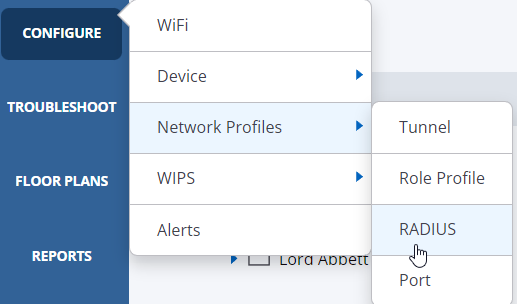

# Setup Radius RadSec Server

--8<--
docs/snippets/login_agni.md
--8<--

## Configuration

1. In AGNI Click on `Configuration → System → RadSec Settings` on the left hand side.

    

3. Copy the FQDN `radsec.beta.agni.arista.io` and `Download the Certificate` at the bottom.
   
    

4. Next, go back to `CV-CUE` and let’s set up a RadSec Server.  

    

5. Click on `Add RADIUS Server`

6. Navigate to `Configure → Network Profiles → RADIUS`

    

