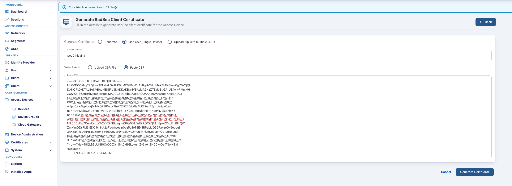

# Configuring RadSec on EOS
Arista Switches can form a RadSec tunnel using SSL encryption with AGNI. RadSec is a protocol that supports RADIUS over TCP and TLS. For mutual authentication it is required to install a client certificate with corresponding private key as well as your AGNI CA certificate. The steps below assumes the use of AGNI's internal PKI.

Follow the steps to create, upload and establish the RadSec tunnel.

1. Generate private key and CSR
2. Generate client certificate for the Switch in AGNI. 
3. Upload the Certificate to the Switch.
4. Configure an SSL profile and and RadSec profile  

--8<--
docs/snippets/login_agni.md
--8<--

## Configuration Steps
1.  Generate the key pair

    ```yaml
    security pki key generate rsa 2048 switch.key
    ```
2.  Generate the certificate signing request using the key just created.

    ???+ tip "Common Name must correspond to the Switch MAC address and the DNS needs to match the hostname of the switch"

    ```yaml
    security pki certificate generate signing-request key switch.key
    ```

    ??? quote "Certificate Signing Request"

        ```yaml hl_lines="1-6 9"
        Common Name for use in subject: 2c:dd:e9:fe:cd:68 
        Two-Letter Country Code for use in subject: US 
        State for use in subject: FL 
        Locality Name for use in subject: NFM 
        Organization Name for use in subject: Arista 
        Organization Unit Name for use in subject: acws 
        Email address for use in subject:
        IP addresses (space separated) for use in subject-alternative-name:
        DNS names (space separated) for use in subject-alternative-name: pod00-leaf1a 
        Email addresses (space separated) for use in subject-alternative-name:
        URIs (space separated) for use in subject-alternative-name:
        -----BEGIN CERTIFICATE REQUEST-----
        MIIC0DCCAbgCAQAwYTELMAkGA1UEBhMCVVMxCzAJBgNVBAgMAkZMMQwwCgYDVQQH
        DANORk0xDTALBgNVBAoMBGFjd3MxDDAKBgNVBAsMA2NzZTEaMBgGA1UEAwwRMmM6
        ZGQ6ZTk6ZmY6MzI6YjIwggEiMA0GCSqGSIb3DQEBAQUAA4IBDwAwggEKAoIBAQC1
        UDFDsidF4qhGzIEgNUlcNPtfvAGic/hQelaD9MgvOUbbVUhEg0hcbA/LLcyZQ+f/
        B0f/UK7eyuNhtS3lTYf7A1TqCQ7md8d4opcKbiP7vFg6+dpvAXT8giBlstv790LY
        wEpuCKX4igkLx+jMlNNOP7tKnuX2tuK/EYi20O2a0e4LR77ebBZpztiia9prCyvk
        neNhtAPMeb/O/kUBnmPwpPDy4jtpPhp8I+xX9zo4nRNjVlFcRRNao/N72kIpnmX8
        nnAXIcG/I1bLsgspWIwwiV3MUL3pOKUNqXaKf824/ZJgPAtUA2zgp9JayMbbddOE
        A3dKTwBkGOXihZkVDTnrAgMBAAGgKjAoBgkqhkiG9w0BCQ4xGzAZMBcGA1UdEQQQ
        MA6CDHBvZDAwLWxlYWYxYTANBgkqhkiG9w0BAQsFAAOCAQEAp8pxdX1qJ8uPFrQW
        ZmMmOZ+RM3lEDOJkhNA2aRVonWeejp0bz5qToT8E41RPyLIdQ56Pa+zeGx5occg8
        3nK3aFAu1ARPR1EJ8E04656c9v6zpF9np3juwLJm0uiM16XgUMvEmQd1anRELndn
        r53jlXKAcsKdFMSaW0MqXY6DN8a1PmI3KL0zzOKpwtcRSjvAXFTN8viSPOL/vrRL
        XTqVaa+P1d7PgRBoSi5DFY6U9nwHD42yP0kCbq98wxDrLyTfMV20ymY083XHdKPz
        Y4dI+YfHeK48QLBSLUKB9CrOC0XyhIMtCxBGkJ+umZy3wktZHCCkvDej7NoiNZal
        4uEbIg==
        -----END CERTIFICATE REQUEST-----
        ```

3. Copy the certificate including the text “-----BEGIN CERTIFICATE REQUEST-----” and “-----END CERTIFICATE REQUEST-----”

4. Select your Access Device from the list and select Get Client Certificate.

5.  Select Use CSR (Single Device) and Paste CSR.

    ???+ tip "Note 1: CSR can also be uploaded from file by selecting action Upload CSR File"

    ???+ tip "Note 2: For signing multiple CSRs select Upload Zip with multiple CSRs"
    
    

6.  Click Generate Certificate. A certificate `pod00-leaf1a.pem` will be generated and downloaded. Rename this file to `switch.pem`

7.  Go to RadSec Setting in the Navigator under Administration section to download the CA certificate.

8.  Download the RadSec CA certificate (radsec_ca_certificate.pem) by clicking Download Certificate.

    In AGNI Click on `Configuration → System → RadSec Settings` on the left hand side.

    

    Copy the FQDN `radsec.beta.agni.arista.io` and `Download the Certificate` at the bottom.
   
    

9.  Copy certificates to the switch
    The certificate and root certificate need to be copied to the switch flash using SCP.
    Prerequisites:
    Settings on switch to be able to SCP over the certs. Provide a username and password with network-admin role. Ensure the following settings are configured on the switch:

    ```yaml
    aaa authentication login console local
    aaa authorization exec default local
    ```
10. Copy the certificates to the switch flash using SCP.

    ```yaml
    scp switch.pem radsec_ca_certificate.pem arista@<switch_ip>:/mnt/flash:
    ```
11. Login to your switch using the `arista` user credentials and verify the certificates are present in the flash.

    ```yaml
    dir
    ```
12. Copy the certificates to the certificate store.

    ```yaml
    copy flash:switch.pem certificate:switch.pem
    copy flash:radsec_ca_certificate.pem certificate:radsec_ca_certificate.pem
    dir certificate:
    ```
13. Verify the certificate validity.

    ```yaml
    show management security ssl profile agni-server
    ```

    ```yaml hl_lines="3"
        Profile     State
        ----------- -----
        agni-server valid
    ```
       
