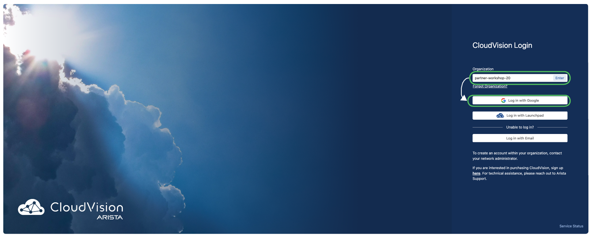
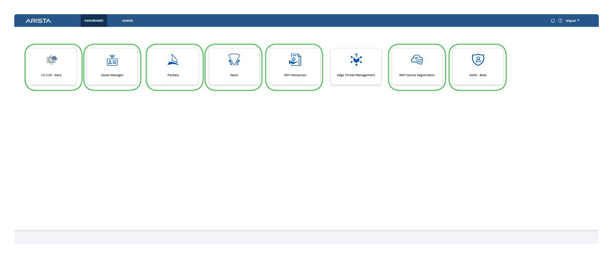

## CloudVision Login

<!-- If you're not already logged into CloudVision (CVaaS), navigate to the [Arista Launchpad](https://arista.io/cv) for your lab.

[:material-rocket-launch-outline: Open Launchpad](https://launchpad.wifi.arista.com/){ .md-button .md-button--primary target=_blank} -->

<!-- === "WiFi Login"
    Workshop SSID: `Arista-Workshop`
    Workshop Password: `AristaRox!` (case sensitive) -->

=== "Login to CVaaS"

    [:material-rocket-launch-outline: Open CVaaS and provide your assigned organization name](https://arista.io/cv/){ .md-button .md-button--primary target=_blank}

    

=== "Login to CV-CUE"

    You will see the various tools tied to your tenant, this includes AGNI (NAC), and CV-CUE for wireless.

    [:material-rocket-launch-outline: Open CV-CUE](https://launchpad.wifi.arista.com/){ .md-button .md-button--primary target=_blank}

    
