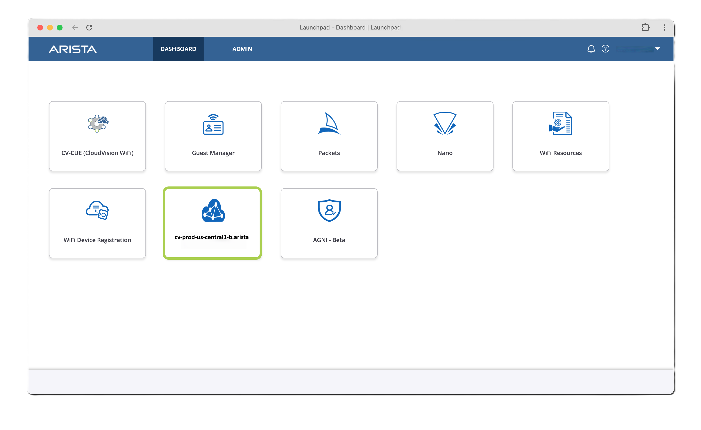

## CloudVision Login

If you're not already logged into CloudVision (CVaaS), navigate to the [Arista Launchpad](https://launchpad.wifi.arista.com/) for your lab.

[:material-rocket-launch-outline: Open Launchpad](https://launchpad.wifi.arista.com/){ .md-button .md-button--primary target=_blank}

=== "WiFi Login"
    Workshop SSID: `Arista-Workshop`
    Workshop Password: `AristaRox!` (case sensitive)

=== "Login Step 1"

    Click the `Log in with Launchpad` button and provide your assigned lab/pod email address and password:

    

=== "Login Step 2"

    You will see the various tools tied to your tenant, this includes CVP, AGNI (NAC), and CV-CUE for wireless. Click into `CVaas Instance` tile to begin this lab.

    
