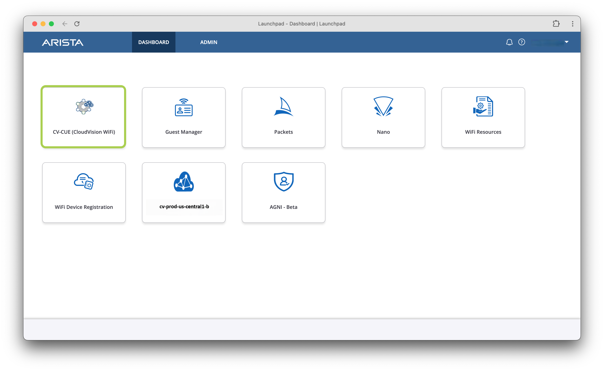

## CV-CUE Login

If you're not already logged into CV-CUE, navigate to the [Arista Launchpad](https://launchpad.wifi.arista.com/){target="_blank"} for your lab.

[:material-rocket-launch-outline: Open Launchpad](https://launchpad.wifi.arista.com/){ .md-button .md-button--primary target=_blank}

<!-- === "Login Step 1"

    Provide your assigned lab/pod email address and password and click `Sign In`

    

=== "Login Step 2"

    You will see the various tools tied to your tenant, this includes AGNI (NAC) and CV-CUE for wireless. Click into `CV-CUE (CloudVision WiFi)` tile to begin this lab.

     -->
