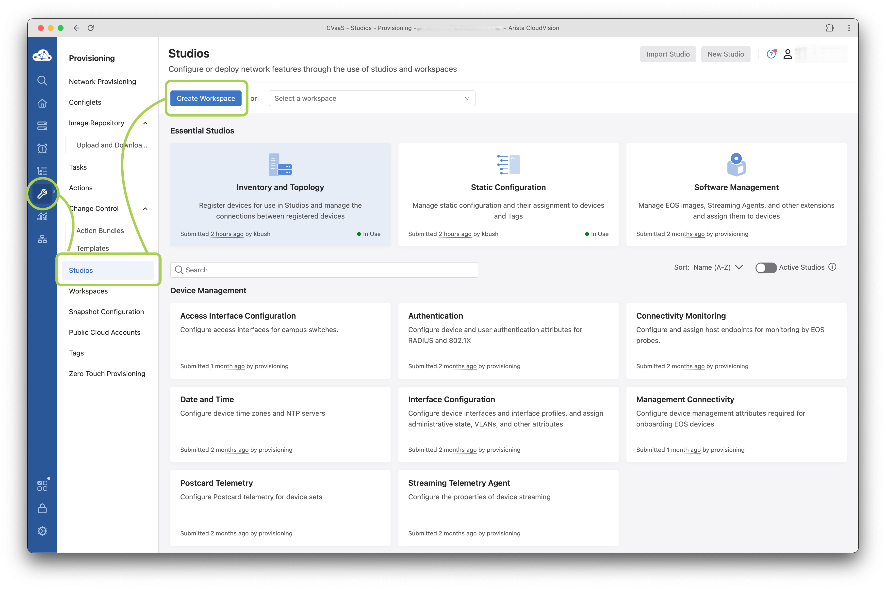
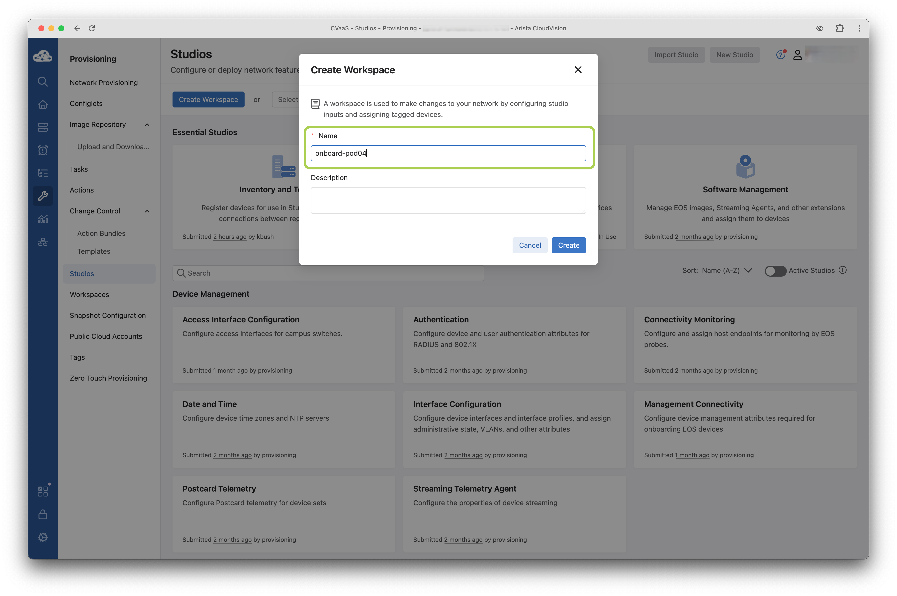

## Create a Workspace

We are going to create a workspace to propose changes to the Network Infrastructure.  A workspace acts as a sandbox where you can stage your configuration changes before deploying them.

??? tip "What is a Workspace?"

    To make a comparison, a workspace is like a [`configuration session`](https://www.arista.com/en/um-eos/eos-configure-session) in EOS or a branch in Git!

=== "Studios Step 1"

    Click on the `Provisioning` :fontawesome-solid-wrench: on the left side, then choose `Studios`.

    

=== "Studios Step 2"
    
    Click `Create a Workspace`, give it any name you would like and click `Create`.

    
